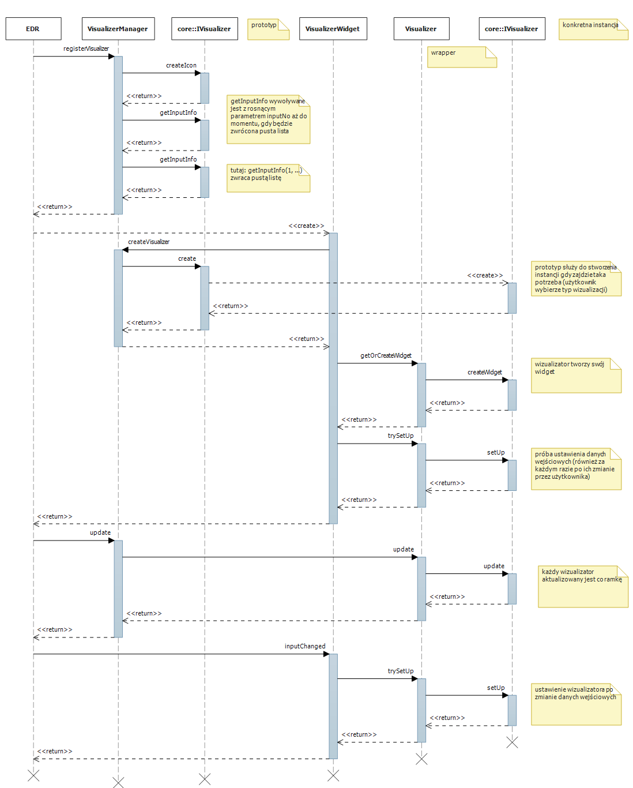
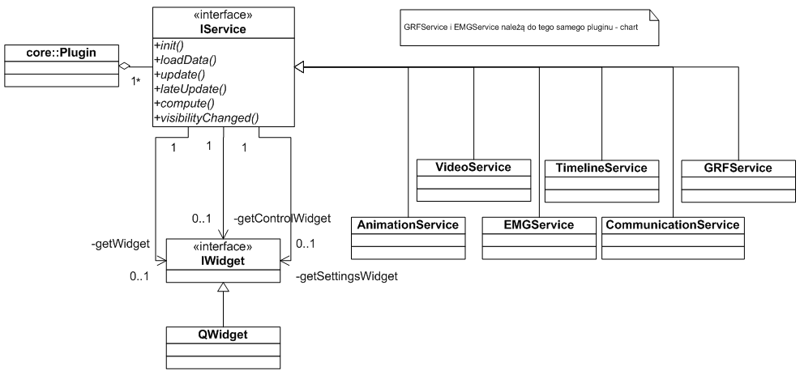
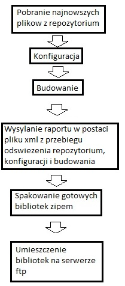

**A new model of data channels - DataChannel**

Since there is a lot of different temporal data in the application (in
the form of an argument – value, where the argument is usually time),
the previous model has been redesigned for the purpose of storing,
managing and accessing this data.

**Underlying interface to raw channel data – index access to data**

The new model proposes to provide interfaces with access to raw data –
after data indexes – assuming that subsequent samples have arguments in
strictly ascending order. These interfaces are completely independent of
the way the data is stored – they do not impose any of the containers,
but they do not provide container-specific accessories – iterators.

**General and Equidistant Channels**

In addition, in the new model, data has been strongly separated from
their interpretation, access and description. The only division that has
been introduced is the division into general data (the requirement that
subsequent arguments are larger than the previous one) and data with an
even distribution of arguments – for this data, access to data by
argument is much more effective, not by indexes. This is done by
introducing helper methods that return the indices of the nearest
samples corresponding to the given value of the argument.

**Interfaces**:

-   [*IRawGeneralDataChannelReader*](https://www.assembla.com/wiki/show/edytor/IRawGeneralDataChannelReader)

-   [*IRawUniformDataChannelReader*](https://www.assembla.com/wiki/show/edytor/IRawUniformDataChannelReader)

**Data accessors**

All data is stored discreetly. Thanks to the interfaces, we become
independent of the actual way of storing data (tamblic, vectors). In the
provided implementations, data is stored in vector containers. The data
is always stored in pairs: argument - value. We have access to each of
the components of such a pair by the index of the samples. To make your
data continuous, you can use accessors – classes that provide access to
data by argument values rather than indexes. An accessor can internally
implement various interpolation methods by returning sample values for
arguments that do not appear explicitly in the channel, but which
theoretically fit within the channel. The accessor can also perform
other functions when accessing data – it can introduce offset and scale
when operating on arguments. Accessors work with the most general data
interface based on index access to the data.

**Interfaces**:

-   [*IDataChannelTimeAccessor*](https://www.assembla.com/wiki/show/edytor/IDataChannelTimeAccessor)

 

**Implementations**:

-   [*SimpleDataChannelTimeAccessor*](https://www.assembla.com/wiki/show/edytor/SimpleDataChannelTimeAccessor)

-   [*GeneralDataChannelTimeAccessor*](https://www.assembla.com/wiki/show/edytor/GeneralDataChannelTimeAccessor)

**Following, auto-modifying channels**

Another novelty are channels that follow other channels and, if
modified, modify themselves based on the channels they follow. This
allows you to introduce, for example, various types of methods to smooth
data in channels, filter data in channels. In order for them to work,
such channels need only simple functional objects that implement the
modification that we want to implement on the watched channel. You can
also create objects that modify modifier objects, thus creating a
sequence of modifications for a given channel, having a copy of each
modification individually.

**Interfaces**:

-   [*IChannelAutoModifier*](https://www.assembla.com/wiki/show/edytor/IChannelAutoModifier)

**Implementations**:

-   [*ChannelAutoModifier*](https://www.assembla.com/wiki/show/edytor/ChannelAutoModifier)

**Timers**

Especially for time data, the concept of Timers – simple classes that
support reading and writing time – has also been introduced. The
interfaces for reading time, for reading and writing time can be
specified here. In addition, an implementation of the simplest Timer is
available. Timers allow us to have one copy of the data and keep
independent clocks for them. This is/can be used in visualizers.

**Interfaces**:

-   ITimer

**Implementations**:

-   Timer

**Utility Classes**

In addition to the above-mentioned elements, several tool classes have
also been introduced. One to retrieve the current value of the channel,
which takes as arguments an accessor and a timer and provides a method
with the signature:

value getCurrentValue(argument)

time-based with timer and how to interpret accessory data.

**Implementation**:

-   [*CurrentValueExtractor*](https://www.assembla.com/wiki/show/edytor/CurrentValueExtractor)

The second auxiliary class is
[*ChannelStats*](https://www.assembla.com/wiki/show/edytor/ChannelStats),
which returns its basic statistics for a given channel – minimum/maximum
value, average, median, variance. However, the type of data that is
stored in the channel must have basic arithmetic operations defined to
determine the values of these statistics.

**Implementation**:

-   [*ChannelStats*](https://www.assembla.com/wiki/show/edytor/ChannelStats)

**Channel implementations**

There are two channel implementations available, one for generic
channels and one for channels with equidistant arguments. These
implementations differ from index-access interfaces in that they are
already containers, because the way data is stored in them is already
strictly defined, so we have access to iterators. In addition, these
implementations allow you to add more samples to the channels, which is
not the case with the base interfaces – access to the data is read-only.

**Implementations**:

-   [*RawGeneralDataChannel*](https://www.assembla.com/wiki/show/edytor/RawGeneralDataChannel)

-   [*RawUniformDataChannel*](https://www.assembla.com/wiki/show/edytor/RawUniformDataChannel)

Channel Decorators – Understanding Arguments and Values

Each channel can be further extended with a description of its arguments
(time) and values. You can specify units and scale for arguments and
values.

**Implementations**:

-   [*ChannelWithDescriptor*](https://www.assembla.com/wiki/show/edytor/ChannelWithDescriptor)

**Class and Interface Declarations**

Below are the basic interfaces and data types with their brief
characteristics and specifications.

-   template&lt;class
    [*PointType*](https://www.assembla.com/wiki/show/edytor/PointType)&gt;
    struct
    [*ConstReferenceType*](https://www.assembla.com/wiki/show/edytor/ConstReferenceType);

This pattern generates a reference constant data type for [*the
PointType*](https://www.assembla.com/wiki/show/edytor/PointType) type,
which is used when passing parameters to avoid copying them.

 

-   [*IChannelDescriptorReader*](https://www.assembla.com/wiki/show/edytor/IChannelDescriptorReader)

An interface that provides a description of the data in the channel:

-   Units of argument (argument – usually time)

-   The scale of the argument (relative to its base unit – e.g. for time
    it will be a multiple of 1 second. A scale value of 60 means that
    the time is in minutes, 3600 in hours, ...)

-   Units of value (various quantities)

-   Scale of values – see scale of the argument

 

-   [*IChannelDescriptorWriter*](https://www.assembla.com/wiki/show/edytor/IChannelDescriptorWriter)

An interface for modifying the channel description available through
[*the IChannelDescriptorReader
interface*](https://www.assembla.com/wiki/show/edytor/IChannelDescriptorReader)

 

-   [*IChannelDescriptor*](https://www.assembla.com/wiki/show/edytor/IChannelDescriptor)

An interface that allows you to read and modify the channel description

 

-   [*ChannelDescriptor*](https://www.assembla.com/wiki/show/edytor/ChannelDescriptor)

Implementation of the [*IChannelDescriptor
interface*](https://www.assembla.com/wiki/show/edytor/IChannelDescriptor)

 

-   template&lt;class
    [*PointType*](https://www.assembla.com/wiki/show/edytor/PointType),
    class
    [*TimeType*](https://www.assembla.com/wiki/show/edytor/TimeType)&gt;
    class
    [*ChannelAutoModifier*](https://www.assembla.com/wiki/show/edytor/ChannelAutoModifier);

A class pattern that allows you to track changes to the observed channel
and make modifications to your own data. Such objects can be combined to
form more complex data modification chains

 

-   template&lt;class
    [*PointType*](https://www.assembla.com/wiki/show/edytor/PointType),
    class
    [*TimeType*](https://www.assembla.com/wiki/show/edytor/TimeType)&gt;
    class
    [*IDataChannelTimeAccessor*](https://www.assembla.com/wiki/show/edytor/IDataChannelTimeAccessor);

Interface pattern that provides access to data by arguments (time)

 

-   template&lt;class
    [*PointType*](https://www.assembla.com/wiki/show/edytor/PointType),
    class
    [*TimeType*](https://www.assembla.com/wiki/show/edytor/TimeType)&gt;
    class
    [*IRawDataChannelBasicWriter*](https://www.assembla.com/wiki/show/edytor/IRawDataChannelBasicWriter);

An interface pattern for adding more samples to a channel. Methods can
throw an exception if they are not supported on the channel.

 

-   template&lt;class
    [*PointType*](https://www.assembla.com/wiki/show/edytor/PointType),
    class
    [*TimeType*](https://www.assembla.com/wiki/show/edytor/TimeType)&gt;
    class
    [*IRawDataChannelExtendedWriter*](https://www.assembla.com/wiki/show/edytor/IRawDataChannelExtendedWriter);

Interface pattern for adding more samples to a channel and modifying
channel values for given indices (does not allow modifying arguments)

 

-   template&lt;class
    [*PointType*](https://www.assembla.com/wiki/show/edytor/PointType),
    class
    [*TimeType*](https://www.assembla.com/wiki/show/edytor/TimeType)&gt;
    class
    [*IRawGeneralDataChannelReader*](https://www.assembla.com/wiki/show/edytor/IRawGeneralDataChannelReader);

Interface pattern for accessing data by indexes – the basic interface
for all channels

 

-   template&lt;class
    [*PointType*](https://www.assembla.com/wiki/show/edytor/PointType),
    class
    [*TimeType*](https://www.assembla.com/wiki/show/edytor/TimeType)&gt;
    class
    [*IRawUniformDataChannelReader*](https://www.assembla.com/wiki/show/edytor/IRawUniformDataChannelReader);

Interface pattern for evenly spaced (fixed-spacing) channels

 

-   template&lt;class
    [*PointType*](https://www.assembla.com/wiki/show/edytor/PointType),
    class
    [*TimeType*](https://www.assembla.com/wiki/show/edytor/TimeType)&gt;
    class
    [*RawGeneralDataChannel*](https://www.assembla.com/wiki/show/edytor/RawGeneralDataChannel);

A class pattern that implements a basic container-like data channel that
provides iterators.

 

-   template&lt;class
    [*PointType*](https://www.assembla.com/wiki/show/edytor/PointType),
    class
    [*TimeType*](https://www.assembla.com/wiki/show/edytor/TimeType)&gt;
    class
    [*RawUniformDataChannel*](https://www.assembla.com/wiki/show/edytor/RawUniformDataChannel);

A class pattern that implements a data channel with an even distribution
of container-like arguments—providing iterators.

 

-   template&lt;class
    [*PointType*](https://www.assembla.com/wiki/show/edytor/PointType),
    class
    [*TimeType*](https://www.assembla.com/wiki/show/edytor/TimeType)&gt;
    class
    [*SimpleDataChannelTimeAccessor*](https://www.assembla.com/wiki/show/edytor/SimpleDataChannelTimeAccessor);

A class pattern that allows access to data by argument that gives the
impression of data continuity. Querying for a value with an argument
less than the anjkm argument in the channel or greater than the largest
(that is, outside the channel range of the channel arguments) returns
the closest sample to it, either the first sample or the last sample.

 

-   template &lt;class
    [*PointType*](https://www.assembla.com/wiki/show/edytor/PointType),
    class
    [*TimeType*](https://www.assembla.com/wiki/show/edytor/TimeType),
    class
    [*PointRefType*](https://www.assembla.com/wiki/show/edytor/PointRefType)
    = typename boost::add\_reference&lt; typename
    [*PointType*](https://www.assembla.com/wiki/show/edytor/PointType)&gt;::type &gt;
    class
    [*ExceptionTimeOverflowResolver*](https://www.assembla.com/wiki/show/edytor/ExceptionTimeOverflowResolver);

A class pattern that supports querying for values for arguments outside
the range of channel arguments. It throws an exception in any case.

 

-   template &lt;class
    [*PointType*](https://www.assembla.com/wiki/show/edytor/PointType),
    class
    [*TimeType*](https://www.assembla.com/wiki/show/edytor/TimeType)&gt;
    struct
    [*DataOperatorsManipulator*](https://www.assembla.com/wiki/show/edytor/DataOperatorsManipulator);

A class pattern for obtaining values for arguments that are within the
range of channel arguments, but not written directly to the channel –
the basis for interpolators and extrapolators.

 

-   template&lt;class
    [*PointType*](https://www.assembla.com/wiki/show/edytor/PointType),
    class
    [*TimeType*](https://www.assembla.com/wiki/show/edytor/TimeType),
    class
    [*TimeOverflowResolver*](https://www.assembla.com/wiki/show/edytor/TimeOverflowResolver)
    =
    [*ExceptionTimeOverflowResolver*](https://www.assembla.com/wiki/show/edytor/ExceptionTimeOverflowResolver)&lt;*PointType*,
    [*TimeType*](https://www.assembla.com/wiki/show/edytor/TimeType)&gt;,
    class Manipulator =
    [*DataOperatorsManipulator*](https://www.assembla.com/wiki/show/edytor/DataOperatorsManipulator)&lt;*PointType*,
    [*TimeType*](https://www.assembla.com/wiki/show/edytor/TimeType)&gt;&gt;
    class
    [*GeneralDataChannelTimeAccessor*](https://www.assembla.com/wiki/show/edytor/GeneralDataChannelTimeAccessor);

A class pattern that allows access to data by argument, giving the
impression of continuity of data. Querying an argument outside the range
of channel arguments results in using the methods of the class provided
for this –
[*TimeOverflowResolver*](https://www.assembla.com/wiki/show/edytor/TimeOverflowResolver)
– to generate the value. In the case of arguments inside the channel,
which are not stored in it, the Manipulator class is used, which is
usually an interpolator.

 

-   template&lt;class
    [*TimeType*](https://www.assembla.com/wiki/show/edytor/TimeType)&gt;
    class
    [*ITimerReader*](https://www.assembla.com/wiki/show/edytor/ITimerReader);

A pattern of an interface that allows you to query for time.

 

-   template&lt;class
    [*TimeType*](https://www.assembla.com/wiki/show/edytor/TimeType)&gt;
    class ITimer;

Interface pattern for querying and setting the time

 

-   template&lt;class
    [*TimeType*](https://www.assembla.com/wiki/show/edytor/TimeType)&gt;
    class Timer;

The pattern of the class implementing the ITimer interface – in fact,
the simplest timer.

 

-   template&lt;class
    [*PointType*](https://www.assembla.com/wiki/show/edytor/PointType),
    class
    [*TimeType*](https://www.assembla.com/wiki/show/edytor/TimeType)&gt;
    class
    [*CurrentValueExtractor*](https://www.assembla.com/wiki/show/edytor/CurrentValueExtractor);

A helper class pattern that allows you to access the current channel
value using the supplied accessor based on the time of the supplied
timer.

 

-   template&lt;class
    [*PointType*](https://www.assembla.com/wiki/show/edytor/PointType),
    class
    [*TimeType*](https://www.assembla.com/wiki/show/edytor/TimeType)&gt;
    class
    [*ChannelStats*](https://www.assembla.com/wiki/show/edytor/ChannelStats);

A utility-class pattern that offers simple channel statistics, provided
that the data type for the value implements basic arithmetic operations.

 

-   template&lt;class
    [*PointType*](https://www.assembla.com/wiki/show/edytor/PointType),
    class
    [*TimeType*](https://www.assembla.com/wiki/show/edytor/TimeType)&gt;
    class
    [*IChannelAutoModifier*](https://www.assembla.com/wiki/show/edytor/IChannelAutoModifier);

An interface pattern for channels that track other channels and modify
their values.

 

-   template&lt;class Channel&gt; class
    [*ChannelWithDescriptor*](https://www.assembla.com/wiki/show/edytor/ChannelWithDescriptor);

A helper class pattern that decorates channels in the form of a
description of stored values and arguments.

**Library Compatibility **

The EDR project is based on a number of external libraries that are
partly made available to clients through a plugin interface:

-   Boost

-   Open Scene Graph,

-   Qt

-   Stl.

In order for the plugin to be properly loaded and run in the
application, it must be built with the same versions of these libraries
as the entire EDR application. Any incompatibility results in an error
message and the plugin not being loaded into the application.

What's more, in the application we are not able to control the version
of external libraries on the basis of which domain objects are created
in plugins. It may happen that two independent plugins create completely
separate domain types with the same database coming from different
versions of the same library. In such a situation, the problem manifests
itself in the fact that the base objects are theoretically recognized as
the same type, but their replacement and handling in theoretically
compatible plugins may result in catastrophic errors resulting from the
unworthiness of interfaces or binary incompatibility.

To partially prevent this, when registering a domain type from an
external library, you must specify the version number of that library.
This rule is extremely important and should be scrupulously followed by
plugin providers. If you don't do this, it can be extremely difficult
and time-consuming to find strange errors in the application related to
direct or indirect operation on a given plugin (entered type)!!

**Remember to update the version of external libraries that you use when
introducing new domain objects!**

The mentioned versions are given in the plugin definition, at the time
of entering/registering domain objects in the form of Object Factories,
where, in addition to the domain object type, the version of the library
on which this type was created should be given, More about the
registration of domain types can be found by reading the documentation
of [*the
ObjectWrapper*](https://www.assembla.com/wiki/show/edytor/ObjectWrapper)
and [*ObjectWrapperT
classes*](https://www.assembla.com/wiki/show/edytor/ObjectWrapperT) and
the factories of these objects.

Coding conventions 
-------------------

Overview
========

The convention used within the project is a port of the Java convention
adapted to the requirements of C++. Therefore, an algorithm should be
used to determine the rules for how to encode a particular issue.

1.  Did you find the answer in this article? If so, go to 4.

2.  Did you find the answer in
    http://www.oracle.com/technetwork/java/codeconventions-150003.pdf?
    If so, go to 4.

3.  Add a disambiguity notice to the Ambiguity section.

4.  Follow the instructions.

Files
=====

-   headers: .h extension

-   Sources: .cpp extension

-   the preferred model is one type (plus its nested types) per header
    and one source file (if needed); An exception to this rule may be
    typical library code that provides functions, macros, or a large
    number of simple types

A question of \#include
=======================

-   Public library headers should include a \#include minimum set of
    headers in the directive, so that there is no need to include more
    specific additional headers in the utility code

-   Public library headers should use the \#incude directive only in the
    &lt;&gt; variant

-   Include directives should be in the following order:

    1.  C++ Standard Headers

    2.  Dependent Library Headers

    3.  Headers of our libraries

    4.  Project Public Headers

    5.  Private Project Headers

Namespaces
==========

-   library code should be placed in its specific namespace

-   The namespace should be a mapping of the directory structure, e.g.
    ::vm::core would refer to files in the /vm/core directory

Type naming
===========

-   no prefixes are used for classes, structures, unions;

-   exceptions are purely virtual interfaces (prefix I)

Buckles
=======

-   on the same line after conditional statements, loops, try, catch

-   on the next line next to the definition of the type or
    function/method

Documentation
=============

-   Documentation should be compatible with any of the formats supported
    by Doxygen

-   All methods should be at least minimally documented (e.g. a return
    tag or a short text description)

Header guards
=============

-   We do not use \#pragma once

-   header guard format: HEADER\_GUARD\_&lt;MODULE&gt;\_\_&lt;NAZWA\_NAG
    Ł ÓWKA\_BEZ\_H&gt;\_H\_\_

Constructors
============

-   Initialization lists should start on a new line; The list start
    character ":" should be the last character in the line with the
    constructor signature

Foo::Foo(Bar\* bar) :\
FooBase(bar), variable1(0), variable2(0){ ...}

Indicators
==========

-   Pointers should not be zero-compared or zero-initialized. The
    nullptr keyword should be used for initialization. In the equations,
    you should either use nullptr or use the default conversion to
    boola.

int \* ptr;\
ptr = 0; // wrong\
ptr = NULL; // wrong\
ptr = nullptr; // good

if ( ptr ) {} // good\
if ( ptr != nullptr ) {} // good\
if ( ptr != 0 ) {} // wrong\
if ( ptr != NULL ) {} // wrong

void foo(int\* bar) {}... foo(NULL); badfoo(0); badfoo(nullptr); well

FAQ Coding 
-----------

### Q: What is the coding convention?

A: The convention is outlined in [*the article Coding
conventions*](https://www.assembla.com/wiki/show/edytor/Konwencje_kodowania).
It is recommended to follow the rules formulated therein. If you have
doubts or an idea for improving the convention, then instead of applying
the changes on your own, start a discussion of the point of ambiguity or
suggestions.

### Q: What knowledge of C++ is required of programmers?

**A**: Very good. And it's not the "I've programmed in C\#/Java before,
I remember C++" type. Similarly, if you think that "C++ is C with
classes", you have a lot to learn. The project is created in idiomatic
C++ (templates, features, polymorphism), with a strong emphasis on the
STL library (collections, iterators, algorithms) and Boost (regular
expressions, smart pointers, polymorphic function objects, utility code
for virtually every field), using the capabilities of the new C++0X
standard (auto, decltype, lambda). A good place to learn about C++ is
the C++ FAQ (http://www.parashift.com/c++-faq-lite/index.html), but it
contains information about the language itself, not about STL and Boost.

### Q: Do we use smart indicators?

**A:** Yes. We use them wherever the clarity and reliability of the code
are more important than pure performance. Depending on the context, you
can use any of the following types:

-   boost::shared\_ptr (mapped to core::shared\_ptr)

-   boost::weak\_ptr (mapped to core::weak\_ptr)

-   boost::scoped\_ptr (Papa on core::scoped\_ptr)

-   OSG::ref\_ptr

-   OSG::observer\_ptr

In the following questions, the above-mentioned types of feeders will be
discussed. But first, a piece of advice: because the introduction of
smart indicators involves replacing the eye-pleasing lines of the type

core::D ata\* data = new core::D ata();

on

core::shared\_ptr&lt;core::D ata&gt; data(new Data());

A very strong emphasis is placed on **creating mnemonics of pointer
types into types as soon as they are defined.** Example:

namespace core { class Data { ... }; typedef shared\_ptr&lt;Data&gt;
DataPtr;}

With this, the previous line turns into:

core::D ataPtr data(new Data());

You can also use the make\_shared function:

core::D ataPtr data = core::make\_shared(new DataPtr());

### Q: When should I use shared\_ptr and weak\_ptr?

**A: shared\_ptr** in most cases. shared\_ptr should be thought of as an
object that shares the reference count for a particular instance of the
object with other instances. Details of the use of these indicators can
be found in the Boost documentation. Note: Note that an object wrapped
with this pointer **cannot be dereferenced and assigned to another
pointer instance**. This is due to the fact that the reference counter
is kept by the shared\_ptr themselves, not by the wrapped object. When
you dereference a "raw" pointer and assign a value to a different
instance of shared\_ptr, there will be two out-of-sync reference counts
of the same object, which is bound to lead to disaster.

core::D ataPtr data(new Data());\
core::D ata\* raw = data.get(); // you can also: core::D ata\* raw =
&\*data;\
core::D ataPtr data2(raw); // will be a disaster!

The shared\_ptr is complemented by weak\_ptr. When using shared\_ptr,
you should avoid **cyclical dependencies**. When object A refers to
object B and object B refers to object A, both will never be deleted
because the counter of both shared\_ptr will always be greater than
zero. When it is necessary to make the indicators cyclical, one of them
**must** be a weak\_ptr that does not increase the reference counter.

### Q: When should I use scoped\_ptr?

**A:** For non-shared private variables and local variables.
Syntactically, it is used as shared\_ptr, but semantically it is
significantly different - it cannot be copied. This makes it a lot
faster.

### Q: When should I use osg::ref\_ptr and osg::observer\_ptr?

**A:** In a sense, these are the equivalent of shared\_ptr and weak\_ptr
for objects from the OSG library (specifically: extending
osg::Referenced). The difference is that the reference count is stored
in the objects themselves, not in the pointers. This **makes it possible
to dereference raw pointers and assign them** to new instances of
ref\_ptr (in fact, the ref\_ptr has an implicit conversion operator to
and from raw pointers). Many types of OSG itself do this, keeping
private variables as ref\_ptr and returning dereferenced raw pointers in
accessors. The same procedure in the case of shared\_ptr is extremely
reprehensible and inappropriate.

osg::ref\_ptr&lt;osg::Geometry&gt; geom = new osg::Geometry(); //
implicit conversion from raw\
osg::Geometry\* geomRaw = geom; // implicit conversion to raw\
osg::ref\_ptr&lt;osg::Geometry&gt; geom2 = geomRaw; // all ok

Other remarks, including the one on periodicity, are valid. For those
familiar with Boost: osg::ref\_ptr is similar to boost::intrusive\_ptr.

### Q: How do I cast smart pointers?

**A: Absolutely** do not dereference a raw pointer, cast it
static/dynamic\_castem and assign it to another instance (in the case of
osg, possible, but not idiomatic). Instead, use
{core|osg}::{static|dynamic}\_pointer\_cast, depending on what pointers
you plan to cast and how.

osg::ref\_ptr&lt;osg::D rawable&gt; drawable;...\
osg::ref\_ptr&lt;osg::Geometry&gt; geom = osg::d
ynamic\_pointer\_cast&lt;osg::Geometry&gt;(drawable);

### Q: Do we use exceptions?

**A:** Yes. However, you have to remember that C++ doesn't work like
C\#/Java and you can't throw an exception and hope that the runtime will
clean up itself. Example:

void foo(){ double \* hugeLeak = new double\[1000000\]; std::string \*
smallLeak = new std::string(); throw std::runtime\_error("bar");}

The variables hugeLeak and smallLeak will never be cleaned up, resulting
in a memory leak. Instead of messing around with internal try/catch
blocks and putting delete in them to remove such leaks, you should use
the [*idiom Resource Acquisition Is
Initialization*](http://en.wikibooks.org/wiki/More_C%2B%2B_Idioms/Resource_Acquisition_Is_Initialization):

void foo(){ std::vector&lt;double&gt; hugeLeak(1000000);
core::scoped\_ptr&lt;std::string&gt; smallLeak(new std::string()); throw
std::runtime\_error("bar");}

The std::vector and core::scoped\_ptr destructors will be called when an
exception is thrown, so that no memory leaks occur.

To sum up: if you're not sure if exceptions won't cause memory leaks,
then you're either using a library written in C and you're going to have
to modify the code a bit, or you're just writing in non-diomatic C++.

### Q: What's the deal with the division of headers into public and private?

**A:** Modular architecture requires a certain convention for sharing
headers. In our case, we have adopted the strategy used in OSG, and
partly also in Qt. It assumes the introduction of file division into:

-   the public part, in our {edr|edrutils}/include/{subproject}
    directory

-   private part, in our {edr|edrutils}/src/{subproject} directory

By definition, only headers can be included in the public part. We apply
here the rule that **in order to use the X type defined in the X.h
header, it is enough to include only this header and exclude it.** In
other words, includes should be added to headers so that all types used
in the header are known. When we use indicators, sometimes we can get
away with the so-called [*forward
declarations*](http://www-subatech.in2p3.fr/%7Ephotons/subatech/soft/carnac/CPP-INC-1.shtml).
That way, you don't have to create bulk headers or stacked directives
\#include when you want to use a specific type from some other module.
Since we're using precompiled headers anyway, it doesn't have much of an
impact on compilation speed, and clarity and versatility gain
significantly.

As mentioned in the encoding convention, we should use the \#include
directive in the public part in the form with angle brackets (&lt;&gt;),
not quotation marks (""). The differences between the two versions are
described
[*here*](http://msdn.microsoft.com/en-us/library/36k2cdd4%28v=VS.100%29.aspx).
For example, the
[*VideoStream.h*](https://www.assembla.com/wiki/show/edytor/VideoStream)
file from vidlib:

\#include &lt;string&gt; // part of the standard library\#include
&lt;vidlib/PixelFormat.h&gt; // the file is located in
&lt;edrutils&gt;/include/vidlib...\
class VideoStream { ... PixelFormat format; thanks to the header, this
type is known ...}

In the private part, of course, there are sources and private headings,
if any. When listing public headers, it's a good idea to use the version
with parentheses as well - then you can be sure that everything is in
the right place. For private headings, however, you should use the form
with quotation marks. For example, the
[*VideoStream*](https://www.assembla.com/wiki/show/edytor/VideoStream).cpp
file from vidlib:

\#include &lt;math.h&gt; // library header\#include
&lt;vidlib/VideoStream.h&gt; // public header\#include "VidLibPrivate.h"
// private header

FAQ Project Construction 
-------------------------

### Q: Where do I even start?

**A:** Projects (edr and edrutils) are organized using CMake. Since we
try to use the latest solutions there, it's best to always have an
up-to-date version. After downloading the project, you should urchomit
cmake-gui, point to the source directory (i.e. edr/src, edrutils/src),
point to the build directory (DO NOT specify the directory subject to
version control; in general, it is best to keep the build in a separate
branch, e.g. in the edr/. directory. /build). When you downloaded the
library package from CI (question below) just click Configure (twice,
until the state of all variables is determined), then Generate and the
walkthrough should be ready in the build directory.

A word of caution here: you shouldn't download the whole liquor, let
alone the whole repo. This then makes it difficult to manage and
navigate the project. Instead, I recommend just downloading /trunk/edr
or /trunk/edrutils.

### Q: How should I organize dependent libraries?

**A: We** use a lot of external libraries in both projects. Especially
on Windows, managing libraries is cumbersome, because often a library
consists of a .lib file (used for linking) and a .dll file (it must be
located under %PATH% or in an executable directory). Thanks to CMake,
the whole process has been simplified. The expected structure of the
library directory is as follows:

&lt;lib&gt;/&lt;platform&gt;/{ debug | release
}/&lt;nazwa\_biblioteki&gt;/&lt;biblioteka\_sk load&gt;. { so | a | lib
| dll | ... }

&lt;platform&gt; is set automatically (PROJECT\_LIBRARIES\_PLATFORM
variable), while &lt;lib&gt; (PROJECT\_LIBRARIES\_ROOT variable) is set
to &lt;src&gt;/.. by default. /.. /Lib. Therefore, when sources are
located in the &lt;EDR&gt;/trunk/src directory, by default the libraries
will be searched in &lt;EDR&gt;/lib. The same applies to library header
files:

&lt;include&gt;/&lt;nazwa\_biblioteki&gt;/&lt;library headers&gt;

&lt;include&gt; (variable PROJECT\_LIBRARIES\_INCLUDE\_ROOT) defaults to
&lt;src&gt;.. /.. /Include. Sometimes libraries have platform-specific
configuration headers. Then they should be located in:

&lt;include&gt;/&lt;platform&gt;/&lt;nazwa\_biblioteki&gt;/&lt;library
headers&gt;

So it's best to **download** a library package from CI, unpack it to a
**directory level higher** than your working copy, and let the whole
thing configure automatically.

### Q: I would like to use my libraries for testing / because I have newer versions / because CI doesn't work, how do I do that?

**A:** You can, of course, throw binaries/headers into the proposed
directory structure. There is a better way - to manually point to search
directories for libraries. You can make changes for the entire project,
for the entire library, or for a part of it.

-   Location of the default library structure -
    PROJECT\_LIBRARIES\_ROOT.

-   location of the default framework subbranch for the debug/release
    version - variables PROJECT\_LIBRARIES\_ROOT\_{DEBUG|RELEASE} (they
    make up the &lt;lib&gt;/&lt;platform&gt;/{debug|release} from the
    previous question).

-   search directory location for the library -
    &lt;library&gt;\_LIBRARY\_DIR\_{DEBUG|RELEASE}

-   location of a specific library member -
    &lt;library&gt;\_&lt;member&gt;\_LIBRARY\_{DEBUG|RELEASE} (on
    Windows, for shared libraries there are
    &lt;library&gt;\_&lt;member&gt;\_LIBRARY\_{DEBUG|RELEASE}\_DLL)

-   Header Localization - &lt;Library&gt;\_INCLUDE\_DIR

-   Localization of configuration headers (for some libraries) -
    &lt;library&gt;\_INCLUDE\_CONFIG\_DIR

### Q: Help! I changed PROJECT\_LIBRARIES\_ROOT /PROJECT\_LIBRARIES\_ROOT\_{DEBUG|RELEASE} / &lt;library&gt;\_LIBRARY\_DIR\_{DEBUG|RELEASE}, and I still have the old libraries indicated! What should I do?

**A:** When the derived variable changes, the derived variable will not
update automatically. The dependencies between the variables are as
follows:

PROJECT\_LIBRARIES\_ROOT = &lt;src&gt;/.. /..
/libPROJECT\_LIBRARIES\_INCLUDE\_ROOT = &lt;src&gt;/.. /..
/includePROJECT\_LIBRARIES\_ROOT\_{DEBUG|RELEASE} =
&lt;PROJECT\_LIBRARIES\_ROOT&gt;/&lt;PROJECT\_LIBRARIES\_PLATFORM&gt;/{debug|release}&lt;library&gt;\_LIBRARY\_DIR
=
PROJECT\_LIBRARIES\_ROOT\_{DEBUG|RELEASE}/&lt;library&gt;&lt;library&gt;\_&lt;member&gt;\_LIBRARY\_{DEBUG|RELEASE}\[\_DLL\]
=
&lt;library&gt;\_LIBRARY\_DIR/&lt;member\*&gt;&lt;library&gt;\_INCLUDE\_DIR
=
PROJECT\_LIBRARIES\_INCLUDE\_ROOT/&lt;library&gt;&lt;library&gt;\_INCLUDE\_CONFIG\_DIR
=
PROJECT\_LIBRARIES\_INCLUDE\_ROOT/&lt;PROJECT\_LIBRARIES\_PLATFORM&gt;/&lt;library&gt;

When you change the "parent" of a variable, you need to delete it and
reconfigure it to update the child value.\* - simplification, specifying
the name of the files is more complicated

### Q: Why do I get a missing dll file on startup?

**A:** Because you didn't check the option PROJECT\_COPY\_MODULES.
Thanks to it, each time you configure it, .dll files will be copied to
the directories with the exe file. This process takes a bit of time and
is cumbersome, which is why it is disabled by default.

### Q: I'm having some weird errors with dll files, what's going on?

**A:** In this situation, it is best to delete the directory
&lt;build&gt;/bin/{Debug|Relaese|...}, select the PROJECT\_COPY\_MODULES
option, configure and build the project from scratch. If something else
is wrong - raise the alarm on assembli/Skype.

### Q: Why do I get errors about missing files when I launch the application?

**A:** Because the PROJECT\_ENABLE\_SVN\_RESOURCES and
PROJET\_ENABLE\_SVN\_RESOURCES\_COPYING options are disabled. The
concept of resources is discussed in the
https://www.assembla.com/spaces/edytor/messages/631875 thread (the names
of the variables have changed slightly). In any case, checking these
options will add resources to the solution, the construction of which
will copy the resources (if there are any in the project) to the
directories with the exe file.

### Q: Assets are being copied and I still have missing files. What's wrong?

**A:** You need to set up a working directory in your environment (this
cannot be done from CMake). In VS2010, &gt;&gt;&gt;just enter
\$(*OutDir*).

### Q: What is variable X used for?

**A:** Variables usually come with comments. All you have to do is hover
your mouse.

### Q: I still don't know what the X variable is for.

**A:** Please contact the author of this article.

### Q: I'd like to upload all my libraries to ftpa, but I don't want to copy them manually. Rescue?

**A:** Select PROJECT\_REBUILD\_DEPENDENCIES and select the variable
path PROJECT\_REBUILD\_DEPENDENCIES\_DIR. All libraries/headers will be
copied to the selected location, while maintaining "our" structure. Then
you remove any junk (.svn directories, etc.), archive the directory,
upload it to ftpa, and anyone can use your CI-generated package instead.

### Q: Is it possible to change the division into "Header files" and "Source files" in Visual Studio?

**A:** Yes, you can do this with the settings in the SOURCEGROUP. I
recommend setting it to "Private", "Public", "Private", "UI".

### Q: I have libraries and headers in the paths CMake found, but CMake still generates errors like "Invalid sign in command - \# not alloved ..". What's wrong?

**A:** CMake has problems with special characters in paths. If you
prefer such characters in paths, use Symbolic links to such directories
so that there are no special characters (\#, etc.) in the path. Symbolic
links under linux are a rather normal thing. For Windows, I recommend
taking a look
[*here*](http://www.howtogeek.com/howto/windows-vista/using-symlinks-in-windows-vista/),
as it is a novelty starting from VIsty. Here, for directories, we are
interested in the /J switch.

### Q: What should I do when the previous advice didn't work and I'm still having trouble finding the right libraries and configuring the project in CMake?

**A:** The last hope is to check the PROJECT/PROJECT\_VERBOSE\_CONFIG
option. This option logs all CMake messages - with their help you should
be able to locate the problem.

DataManager 
------------

DataManager
===========

[*The
DataManager*](https://www.assembla.com/wiki/show/edytor/DataManager) is
designed to manage the resources of measurement samples and materials
such as models, shaders or application skins. Management is about
providing the initialized resources that services are asking for. The
whole thing is based on [*the IDataManager
interface*](https://www.assembla.com/wiki/show/edytor/IDataManager) and
queryParsers functions that allow you to pass the appropriate parsers on
demand, of course, if the parser you are looking for is registered by
the DM.

IDataManager Interface
======================

The most important interface methods:

  void findResources()                                                                                Searches for application resources.
  --------------------------------------------------------------------------------------------------- -------------------------------------------------------------------
  void findLocalTrials()                                                                              Searches for local samples.
  void loadResources()                                                                                Load all application resources.
  void loadTrial(const [*LocalTrial*](https://www.assembla.com/wiki/show/edytor/LocalTrial)& trial)   Loading a single local sample.
  coid clear()                                                                                        Cleaning of resources (including measurement tests).
  const std::string& getApplicationSkinsFilePath(int i)                                               Retrieve the ith path to the app skin from the list of tracks.
  int getApplicationSkinsFilePathCount()                                                              Retrieving information about the number of app skins on the list.
  bool isLoadLocalTrialData() const                                                                   Have you loaded a local test sample?
  int getLocalTrialsCount() const                                                                     Number of measurement attempts in resources.
  void loadLocalTrial(int i)                                                                          Loading the ith test from DM resources.
  void loadLocalTrial(const boost::filesystem::p ath& path)                                           Loading the sample from the specified path.
  void registerParser(core::*IParserPtr* parser)                                                      Registers the specified parser.
  Core::*IParserPtr* getParser(int idx)                                                               Initialized parser at a given index.
  Core::*IParserPtr* getParser(const std::string& filename)                                           The parser associated with the specified filename.
  int getNumParsers() const                                                                           The number of parsers initialized.

Creating a parser
=================

Parsers are similar to plugions in terms of creation and registration.
The parser we want to register should inherit from the IParser
interface, then we use the CORE\_PLUGIN\_ADD\_PARSER macro to register.

IParser Interface

  void parseFile(const boost::filesystem::p ath& path)                                           This is where the reading of the file takes place, path is the path to the file to be read.
  ---------------------------------------------------------------------------------------------- --------------------------------------------------------------------------------------------------------------------------------------------------------------------------------------
  IParser\* create()                                                                             A new instance of the type of the currently initialized parser.
  std::string getSupportedExtensions() const                                                     A very important method. Returns the extensions that the parser supports in the format "xxx;yyy; zzz", where xxx, yyy and zzz are extensions, the semicolon serves as the separator.
  [*ObjectWrapperPtr*](https://www.assembla.com/wiki/show/edytor/ObjectWrapperPtr) getObject()   A parser data object passed by a wrapper.

As you can see, the interface is simple, the handling of parsers is done
inside the DM. Using parsers involves associating parsers with files
that are managed by [*the
DataManager*](https://www.assembla.com/wiki/show/edytor/DataManagera).

Getting parsers
===============

Services have a loadData(*IServiceManager*\* serviceManager,
[*IDataManager*](https://www.assembla.com/wiki/show/edytor/IDataManager)\*
dataManager). The method is executed when the sample is loaded by the
editor. The parser is dereferenced using the template functions
core::queryParsers(), which always take an instance as the first
argument
[*IDataManager*](https://www.assembla.com/wiki/show/edytor/IDataManagera).
Functions return an instance of a parser of a particular type or
core::*IParserPtr*() in case the parser you are looking for is not
found. The returned parsers are initialized inside the
[*DataManager*](https://www.assembla.com/wiki/show/edytor/DataManagera),
do not call the parseFile() method as a default.

There are three overloaded functions of queryParsers. The simplest one
searches for a single parser of a specific type, the next version
dereferences a parser for a specific type and the corresponding file,
the last version is used to dereference lists of parsers of a specific
type.

Filesystem 
-----------

Description
===========

Filesystem is a single class with static methods that allow basic
operations on directories and files. The methods ensure that they work
correctly on Unixes and Windows systems without the need for
preprocessor directives.

List of methods
===============

  static void createDirectory(const std::string& path)                                                                                    Creates a folder with the specified path. In case there is no folder in the middle of the path, a folder will also be created, e.g. by specifying the path first/second/third where only first exists, the second and third will be created.
  --------------------------------------------------------------------------------------------------------------------------------------- ----------------------------------------------------------------------------------------------------------------------------------------------------------------------------------------------------------------------------------------------
  static void deleteDirectory(const std::string& path)                                                                                    Removes the folder from the specified path along with its contents.
  static void deleteFile(const std::string& path)                                                                                         Deletes a single file.
  static void move(const std::string& pathOld, const std::string& pathNew)                                                                Moves a file or folder along with its content at the specified path. If there is a file with the same name in the destination, the file will be overwritten.
  static std::vector&lt;std::string&gt; listFiles(const std::string& path, bool recursive, const std::string& mask)                       Lists files that meet the requirements of the mask (file extensions, e.g. ".avi"). To list files and subfolders, set recursive to true.
  static std::vector&lt;std::string&gt; listFiles(const std::string& path, bool recursive, const std::vector&lt;std::string&gt;& masks)   An overloaded method allows you to specify more than one mask.
  static std::vector&lt;std::string&gt; listSubdirectories(const std::string& path)                                                       Lists all subfolders of a given folder.

Combining Qt and OSG (QWidgety OSG) 
------------------------------------

Since the application is based on Qt (high-level UI) and OSG (graphical
API), it is necessary to enable the combination of both environments.
There are several ways to do this, but you should always use the core:
type:[*QOsgDefaultWidget*](https://www.assembla.com/wiki/show/edytor/QOsgDefaultWidget).
The types have identical interfaces, so you can switch between them as
part of your tests.

Visualizers & Timeline 
-----------------------

To separate the strong dependency of the data series available in the
visualizers and the channels in the Timeline, two such classes were
derived in the visualizers instead of a single data serri base class.
Both of these classes are defined in the IVisualizer interface.

The first one -
[*SerieBase*](https://www.assembla.com/wiki/show/edytor/SerieBase) is
the base class of all data series. It should be used only for data with
a static character, where the time change does not play any role. For
temporal data, the second base type - [*TimeSerieBase - has been
derived*](https://www.assembla.com/wiki/show/edytor/TimeSerieBase). It
supports setting the time for a given series from the outside, changing
its scale and offset. This allows us to easily wrap such data series
into Timeline-related channels.

To make it easier to wrap channels, 2 classes have been prepared to
improve switching between visualizer data series and timeline channels.
Both classes share a common base interface,
[*IVisualizerChannel*](https://www.assembla.com/wiki/show/edytor/IVisualizerChannel).
This interface inherits from the channel interface from Timeline and
extends it with a purely virtual releaseChannel() method.

The first class, VisualizerChannel, is used to wrap a single series of
visualizer data into a channel and place it in a timeline. The second
one - VisualizerMultiChannel - allows you to contain several series of
temporal data in the form of a single Timeline channel. The second class
is used, among other things, to decompose [*a
VectorChannel*](https://www.assembla.com/wiki/show/edytor/VectorChannel)
into 3 independent scalar components and add them to a chart visualizer.
In this way, we have 3 components of the vector that are closely related
in time, there are 3 independent data series on the visualizer and in
the Timeline we have one collective channel for them. Deleting this
channel from the Timeline results in the deletion of all 3 series
associated with it from the visualizer(s).

The idea of the releaseChannel method implemented in these classes
should be discussed here. Its need arises from the fact that the most
general visualizer, where the user himself manages the type of
visualizer and its visible data series, on the basis of the available
data, manages the series and channels himself. On the other hand, we
have a mechanism to manage these elements as a result of user operations
on the tree that represents the data. The purpose of the relaseChannel()
method is to inform a given visualizer channel that the data series
associated with it have already been deleted from the visualizers and
there is no need to delete them again, which would result in errors when
the channel is destroyed. It should be noted that such channels are
destroyed only at the time of destruction of the Timeline service, i.e.
at the time of unloading plugins. These operations take place after the
Qt application has been destroyed, so visualizers and their widgets do
not exist. Therefore, by deleting a channel from the Timeline while the
application is running, we are automatically assured of the removal of
the associated series of data from the visualizers, and destroying the
channel when the application is closed is safe, because we release the
visualizer channels earlier with the releaseChannel() method.

 

SUMMARY:

By managing data series and channels in TImeline from the outside:

1\) We create a data series:

auto serie = vis-&gt;createSerie(data, name);

2\) We are trying to get a series of a timed nature:

auto timeSerie = boost::d
ynamic\_pointer\_cast&lt;IVisualizer::TimeBaseSerie&gt;(series);

3\) If the series is temporary, we close it in the channel for
visualizers:

VisualizeChannelPtr channel(new VisuzalizerChannel(serie,visu)); visu is
the VisualizerWidget in which our visualizer is embedded, for which we
have generated a series

4\) Add such a channel to the timeline in a standard way:

a\) search websites for the Timeline interface:

TimelinePtr timeline =
core::queryServices&lt;ITimelineService&gt;(core::getServiceManager());

b\) if the service exists, we try to add a channel and remember that we
have created such a channel from the series of visualizers:

try{

timeline-&gt;addChannel(path.toStdString(), channel);

visualizerChannels.insert(channel); important for the correct release of
visualizer channels at the time of destruction of the application, the
visualizerChannels variable used in the destructor of the HmmMainWindow
class

}catch(...) {

LOG\_ERROR("Could not add visualizer channel to timeline!");

}

Running the sample plugin 
--------------------------

**Requirements:**

The language used to create the editor and plug-ins is C++0x, so for
Windows they are created in Visual Studio 2010. It is best to create a
plugin project using the CMake tool; The example was created in version
2.8.4 of this tool, but it's best to always use the latest version.

**Steps needed to build the sample plugin (using CMake):**

**1. Download the plugin from the svn repository**

**2. Download the library package from the ftp server
(dev/plugin\_libs)**

**3. Unzip the library to the main folder (where the plugins folder
already exists).**

**4. Run CMake.**

**5. In the "Where is the source code" field, set the folder
"plugins\\src"**

**6. In the "Where to build the binaries" field, set your own folder,
e.g. \[main folder\]\\bin**

**7. Press "Configure"**

The configuration process should be error-free (don't worry if a version
of the library only exists in the release version).

**8. Press "Generate"**

If everything went smoothly, then at this point, there should be a
correct walkthrough in the folder set in step 6.

**Steps needed to enable debugging of the plugin (CMake)**

Unfortunately, not everything can be set from CMake. Although you should
already be able to compile the plugin, debugging requires a few more
steps.

**0. Set the active configuration to
[*RelWithDebInfo*](https://www.assembla.com/wiki/show/edytor/RelWithDebInfo)**

This is set in Solution Configurations in the toolbar (the debug version
will not work with the installation version of the application, the
release version will not be debuggable.

**1. Set Output Directory**

In *Properties - &gt; Configuration Properties -&gt; General -&gt;
Output Directory*, set the Application Data\\plugins folder of the
installed application (this is best illustrated by a real-life example:
"C:\\Users\\Wojtek\\[*AppData*](https://www.assembla.com/wiki/show/edytor/AppData)\\Local\\PJWSTK\\EDR\\plugins"

**2. Set Command and Working Directory**

In *Properties - &gt; Configuration Properties -&gt; Debugging* should
be set:

for Command, the path to the file core.exe installed application (e.g. :
"C:\\Program Files (x86)\\EDR\\bin\\core.exe"):

for the Working Directory folder where the core.exe file is located
(e.g. : "C:\\Program Files (x86)\\EDR\\bin")

**3. Set plugin\_example1 as a startup project**

Press the right mouse button on the project and then "Set as Startup
Project"

Some assumptions have changed and the descriptions below are not valid!

**Steps needed to compile the sample plugin (without using CMake):**

**1. Download the plugin from the svn repository**

**2. Set the configuration to "Release" mode**

**3. Add the headers you need**

You need to remove the previously set in the project
(properties\\configuration properties\\c/c++\\general\\additional
include directories). Then set the following headers: - from the package
downloaded from ftp : include\\qt include\\boost include\\utils - from
edr/include - from bin (core\\Config.h needed)\
** **

**4. Add the necessary libraries** (properties\\configuration
properties\\linker\\input\\additional dependencies): - from the package
- it is very important that the libraries in the package agree with the
libraries with which the application has been linked.

To compile the plugin you need the following: libboost\_system-mt.lib;
libboost\_filesystem-mt.lib;
[*QtGui4.lib*](https://www.assembla.com/wiki/show/edytor/QtGui4);
[*QtCore4.lib*](https://www.assembla.com/wiki/show/edytor/QtCore4)

**5. Set preprocessor directives** (properties\\configuration
properties\\C/C++\\Preprocessor) \_\_WIN32\_\_; WIN32; NDEBUG
;\_WINDOWS; \_WINDLL; \_USRDLL; BOOST\_ALL\_NO\_LIB; EDRTEST\_EXPORTS;

 

After these steps, your project should compile correctly.

 

**The steps needed to enable debugging of the plugin.**

Debugging is possible if you copy the created DLL to the bin folder in
the installed application, and then run the application appropriately
from within Visual Studio. There are several ways to accomplish this,
the following is one of them.

**1. Create a post-*BuildEvent*** ( properties\\configuration
properties\\Build Events\\Post-Build Event )

In the Command Line field, type (including the correct paths)

copy
\$(*SolutionDir*)\$(Configuration)\\\$([*ProjectName*](https://www.assembla.com/wiki/show/edytor/ProjectName)).dll
"C:\\Program Files (x86)\\EDR\\bin\\plugin\_test.dll"

Note 1 - The application will load the plugin only if its name follows
the accepted convention (plugin\_\*.dll).

Note 2 - For Vista/Windows 7 systems, you need ownership rights to copy
this file. There are many ways to work around this problem, e.g. you can
run Visual Studio in administrator mode, you can also create a file,
e.g. postBuild.bat with the above command, a shortcut to this file
postBuild.lnk, in the advanced properties of this shortcut set "run as
administrator", and the Command Line of our Event enter the path to the
created shortcut (e.g. \$(*SolutionDir*)postBuild.lnk)\
**2. Set paths** (properties\\configuration properties\\debug):
'Command' to the core.exe file in the application folder (e.g.
C:\\Program Files (x86)\\EDR\\bin\\core.exe) 'working directory' to the
folder where the application is located (more specifically core.exe;
e.g. C:\\Program Files (x86)\\EDR\\bin)

**3. Activate debugging in Release mode**

To do this, set the appropriate options:

In properties\\configuration properties\\c/c++\\general - Debug Info
should be set to "Program Database".

In properties\\configuration properties\\linker\\debugging - Generate
Debug Info should be set to YES.

 

After that, you should be able to run and debug the plugin.

**Directory Structure **

The editor, in its current version, assumes the existence of three
directory trees. These are:

1.  **[*UserData*](https://www.assembla.com/wiki/show/edytor/UserData)** -
    Directory from which measurement samples and examples are loaded. 
    By default, it is associated with the user's documents. For windows,
    this will be the "My Documents" folder with the EDR suffix.
    Example - "C:\\Users\\Wojtek\\Documents\\EDR"

2.  [***ApplicationData***](https://www.assembla.com/wiki/show/edytor/ApplicationData) -
    A directory to which a running application can write data as needed.
    For Windows it is the
    [*AppData*](https://www.assembla.com/wiki/show/edytor/AppData)\\Local\\
    folder with the appropriate suffix - PJWSTK\\EDR. Example -
    "C:\\Users\\Wojtek\\[*AppData*](https://www.assembla.com/wiki/show/edytor/AppData)\\Local\\PJWSTK\\EDR"

3.  **Resources** - Points to the "resources" directory in the foldr
    where the application is installed. Contains its local resources
    (e.g., icons). Example - "C:\\Program Files
    (x86)\\EDR\\bin\\resources".

The
[*IDataManager*](https://www.assembla.com/wiki/show/edytor/IDataManager)
interface provides 3 methods that allow you to access the folders
discussed.

    ! returns the full path to the "*MyDocuments*\\EDR"\
virtual const Path& getUserDataPath() Const = 0;\
! returns the full path to the "*ApplicationData*\\EDR"\
virtual const Path& getApplicationDataPath() Const = 0;\
! Returns the full path to the application's resources folder\
virtual const Path& getResourcesPath() Const = 0;

The IDataManager *interface* is very easy to access. Use the
core::getDataManager() function.

Retrieving the path for an icon located in one of the subdirectories of
the **Resources** tree will look like this:

boost::filesystem::p ath p =
core::getDataManager()-&gt;getResourcesPath() / "icons/video.png"

Linking plugins with external libraries 
----------------------------------------

In order for CMake to recognize and configure plugin dependencies on
external libraries (e.g. libraries with edrutils) you need to in the
edr\\src\\*CMakeModules* place a CMake configuration to search for a
specific library to use for our plugin. As in this file we will define
the name of this library, we will have to refer to such a dependency
when writing a CMake script for the project of our plugin. An example
and the simplest CMake configuration file for searching for external
libraries can be previewed in ready-made scripts in the listed directory
(e.g.
[*FindKinematicLib*](https://www.assembla.com/wiki/show/edytor/FindKinematicLib)
whether [*FindVdf*](https://www.assembla.com/wiki/show/edytor/FindVdf)).
These are plain text files with names that start with the word Find and
end with the name of the module they want to search for.

Domain objects and polymorphism using RTTI 
-------------------------------------------

The RTTI (http://en.wikibooks.org/wiki/C++\_Programming/RTTI) mechanism
is very limited. Type std::type\_info, returned by typeid, contains much
less information than, for example, the Type class from C\#.
Importantly, there is no information about the base class of a given
type, and it is not possible to obtain the types of derived classes.\
\
Objects returned by the function
core::queryDataPtr&lt;T&gt;(core::*IDataManager*\*, bool) could
therefore be correctly returned for the specific type that was supplied
to the object
[*ObjectWrapperPtr*](https://www.assembla.com/wiki/show/edytor/ObjectWrapperPtr).
In other words, if you set an object with the set&lt;T&gt; then it would
only be possible to retrieve an object of class T from it, you cannot
get a base class to T! The following example illustrates this:

A hierarchy is defined:\
**[*ScalarChannel*](https://www.assembla.com/wiki/show/edytor/ScalarChannel)
&lt;- C3DAnalogChannel &lt;- EMGChannel.**\
\
Setting
[*ObjectWrapper*](https://www.assembla.com/wiki/show/edytor/ObjectWrapper)
is implemented in the following way:\
Core::*ObjectWrapperPtr* emgChannel;\
...\
[*EMGChannelPtr*](https://www.assembla.com/wiki/show/edytor/EMGChannelPtr)
ptr(new EMGChannel(\*data , i));\
emgChannel-&gt;set&lt;EMGChannel&gt;(ptr);\
\
For the object set in this way, you can get an EMGChannel:\
std::vector&lt;core::EMGChannel&gt; emgChannels =
core::queryDataPtr(dataManager);\
However, there is no way to retrieve this data as C3DAnalogChannel:\
std::vector&lt;core::C3DAnalogChannel&gt; c3dChannels =
core::queryDataPtr(dataManager);\
\
Happy problem can be solved, for this you need to create create a
specialization of type
[*ObjectWrapperKey*](https://www.assembla.com/wiki/show/edytor/ObjectWrapperKey).
Instead of going into implementation details, it's more convenient to
use an existing macro: CORE\_DEFINE\_WRAPPER. To maintain our class
hierarchy, we need to create a few of these macros explicitly indicating
how these types are arranged in the hierarchy:\
\
CORE\_DEFINE\_WRAPPER(*ScalarChannel*, utils::*PtrPolicyBoost*);
CORE\_DEFINE\_WRAPPER(C3DAnalogChannel,
[*ScalarChannel*](https://www.assembla.com/wiki/show/edytor/ScalarChannel));
CORE\_DEFINE\_WRAPPER(EMGChannel, C3DAnalogChannel);\
\
Thanks to this procedure, a multimap in the classroom is created
[*DataManager*](https://www.assembla.com/wiki/show/edytor/DataManager)
and for a single object, e.g. EMGChannel channel Entries are created:\
&lt;typeid(*ScalarChannel*), channel&gt;&lt;typeid(C3DAnalogChannel),
channel&gt;&lt;typeid(EMGChannel), channel&gt;\
\
With std::type\_info There are two additional, quite significant
problems. A type\_info object has a private copy constructor and a
private assignment operator. To store such objects, you need to wrap
them with some class or structure of your own. In EDR type\_info is
wrapped by a struct core::Type. The second problem is comparing. As it
turns out, the comparison operator does not always return equality with
equal types. For example, it may be the case that
typeid(std::vector&lt;int&gt;) != typeid(std::vector&lt;int&gt;) if the
vectors are from different libraries. Comparisons should be made by name
(std::type\_info.name()).

Overall architecture of the application 
----------------------------------------

Visualizers
===========

Parsers and data loading 
-------------------------

Assumptions
===========

-   Client (service) code should be able to load domain data (related to
    human character motion processing) in a highly abstract way

-   Client code should not explicitly use paths and filenames with
    domain data

-   Client code should not run in filespace at all, only in the data
    space

-   The data system should be easily extensible without recompiling the
    entire application and all services

-   Only data that is used should be loaded

Problems
========

-   Some types of data come from OSG, some are ours, others can come
    from other sources - you can't create a base class and use simple
    polymorphism

-   OSG objects should be referenced by osg::ref\_ptr, other data should
    be referenced by boost::shared\_ptr - type mismatch

-   In the editor, we don't know what types of data we will have to work
    with - a consequence of modularity

-   Some data objects are in a 1-to-1 relationship to files, sometimes
    files contain multiple data objects (e.g., c3d)

Solution
========

Add data types
--------------

### core::ObjectWrapper

-   Circumvent the constraints of the heterogeneous nature of data

-   Stores a pointer to an object according to parameterized policy

-   Wrappers are defined by the CORE\_DEFINE\_WRAPPER macro; The second
    parameter is either the principle of using pointers
    (utils::*PtrPolicyBoost* or utils::*PtrPolicyOsg*), or some type for
    which a wrapper has already been defined

namespace core {typedef DataChannel&lt;float, float&gt; ScalarChannel;
class C3DAnalogChannel : public ScalarChannel {}; class EMGChannel :
public C3DAnalogChannel {}; typedef shared\_ptr&lt;EMGChannel&gt;
EMGChannelPtr;} CORE\_DEFINE\_WRAPPER(ScalarChannel, utils::P
trPolicyBoost); CORE\_DEFINE\_WRAPPER(EMGChannel, ScalarChannel);
CORE\_DEFINE\_WRAPPER(GRFChannel, ScalarChannel);

-   You don't use this type explicitly anywhere except in your own
    parser implementation

core::ObjectWrapperPtr wrapper;// create wrapper\
wrapper =
core::ObjectWrapper::createWrapper&lt;core::EMGChannel&gt;();// set the
object in the
wrapperzewrapper-&gt;set&lt;core::EMGChannel&gt;(EMGChannelPtr(new
EMGChannel());// get the object from the parser\
EMGChannelPtr channel = wrapper-&gt;get&lt;core::EMGChannel&gt;();

### core::IParser

-   A very simple interface for the parser - an intermediate layer
    between the parser (usually in the form of a dependent library) and
    the logic of the editor

-   That is: the logic layer should be very thin and consist in
    extracting data objects from external, non-EDR parses

-   Implementations provided by plugins

-   Precisely defined life cycle: creation-&gt;assignment to
    file-&gt;deletion

-   Can't go back to a previous stage

-   One file is never parsed multiple times

-   It is never assigned to multiple files

-   Implementations are the only user code that directly deals with
    core::*ObjectWrapper*, but this code should be limited to creating
    an instance of wrappers (when creating a parser) and assigning
    objects to them (when parsing)

-   **In the constructor you need to create all instances of
    core::*ObjectWrapper*to which the data will be assigned during
    parsing**

-   **The parser is also a factory for itself (create method)**

-   As an example, I recommend seeing C3DParser and
    [*VideoParser*](https://www.assembla.com/wiki/show/edytor/VideoParser)
    (TODO: add links)

Retrieving data
---------------

### core::queryData and core::queryDataPtr

-   A global function that is a leaf of the entire architecture

-   Services should dereference data objects only with them, without
    referencing either core::IParser or core::*ObjectWrapper*

-   It frees you from the obligation to think about files, their
    loading, the presence of data, etc.

std::vector&lt;core::EMGChannelPtr&gt; channels =
core::queryData&lt;core::EMGChannel&gt;(dataManager);    BOOST\_FOREACH(
core::EMGChannelPtr channel, channels ) { // do something with the
channel }

-   If you don't remember the type of the smart pointer ( [*here
    EMGChannelPtr*](https://www.assembla.com/wiki/show/edytor/EMGChannelPtr)),
    you can use the auto word (the compiler will recognize the types
    itself)

auto channels = core::queryData&lt;core::EMGChannel&gt;(dataManager);   
BOOST\_FOREACH( auto channel, channels ) { // do something with the
channel }

-   There is also the queryDataPtr method, the parameter of which is not
    the type of the object, but the type of the smart pointer

// the first version, the most portable but the most verbose
std::vector&lt;core::GRFChannelPtr&gt; channels1;   
core::queryDataPtr(dataManager, channels1);\
\
// one-line version, but with two std::vector&lt;core::GRFChannelPtr&gt;
channels2 = core::queryDataPtr&lt;core::GRFChannelPtr&gt;(dataManager);\
\
// one-line version, single type with keyword auto auto channels3 =
core::queryDataPtr&lt;core::GRFChannelPtr&gt;(dataManager);\
\
// one-line version recommended, single type pass thanks to the Return
Type Resolver idiom std::vector&lt;core::GRFChannelPtr&gt; channels4 =
core::queryDataPtr(dataManager);\
\
// version causing compile error - no specified :) type // auto
channels5 = core::queryDataPtr(dataManager);\
\
// STRONGLY DISCOURAGED use of queryDataPtr2 in BOOST\_FOR\_EACH - makes
a copy of vector BOOST\_FOREACH( auto channel,
core::queryDataPtr&lt;core::GRFChannelPtr&gt;(dataManager) ) {};\
\
// equivalent to the above, same note BOOST\_FOREACH(
core::GRFChannelPtr channel,
core::queryDataPtr&lt;core::GRFChannelPtr&gt;(dataManager) ) {};\
\
// compile-time error version // BOOST\_FOREACH( core::GRFChannelPtr
channel, core::queryDataPtr(dataManager) ) {};\
\
// recommended version std::vector&lt;core::GRFChannelPtr&gt; channels6
= core::queryDataPtr(dataManager);    BOOST\_FOREACH(
core::GRFChannelPtr /\*or auto\*/ channel, channels6 ) {} /\
\
/ also recommended auto channels7 =
core::queryDataPtr&lt;core::GRFChannelPtr&gt;(dataManager);   
BOOST\_FOREACH( core::GRFChannelPtr /\*or auto\*/ channel, channels6 )
{}

Mode of action
--------------

The CORE\_DEFINE\_WRAPPER macro creates a core::*ObjectWrapperT*,
inheriting from core::*ObjectWrapper* or after another specialization.
Allows
[*ObjectWrappers*](https://www.assembla.com/wiki/show/edytor/ObjectWrappery)
They have their own hierarchy of classes that can be polymorphized, and
by storing type\_info template parameter, this can be translated into
the hierarchy of classes of the actual data objects. In any case, from
the instance of core::*ObjectWrapper* You can retrieve a list of types
(again type\_info) that are supported. This allows you to build a
multimap indexed by type. From there, it's a short way to getting the
actual data from the wrappers.

### Parser Registration

[*DataManager*](https://www.assembla.com/wiki/show/edytor/DataManager)
(DM) is an aggregate of parsers. Parsers are registered during
application initialization. These instances will never be assigned to
any files and will always only serve as factories - for calls to the
create() method. To make things easier, parsers are mapped to the
extensions they support (multimap, extension conflicts between parsers
still need to be resolved).

### Loading a sample

Sample loading should not be confused with resource loading. When
loading a sample, parser instances are created for each of the files
whose extension is in the extension dictionary, but **they are not yet
parsed**. To make it easier to manage, DM stores these new instances
encased in an internal Parser type that provides some state information
(e.g., whether the instance has already been used). After scanning the
sample directory, a list of objects of type
[*DataManager*](https://www.assembla.com/wiki/show/edytor/DataManager)::P
arser is created, which encapsulate the new core::IParser instances.
Each parser creation is accompanied by querying it for data objects. Of
course, these objects won't point to anything yet (they shouldn't, after
all, there was no parsing), but they can already provide information
about supported types, so you can create a multimap of types and objects
assigned to them.

### Loading Resources

As mentioned earlier, no resources are loaded before the demand occurs.
This demand is reported by the core::queryData and core::queryDataPtr
functions. They redirect the query to the DM, which scans the multimap
of objects assigned to the types and checks the following schema:

-   Has the object been loaded before?

    -   Yes: add it to the result list

    -   No: Has the parser from which the object originated already been
        used?

        -   Yes: a data error or a parser implementation error

        -   Don't: parse; Has the object been loaded?

            -   Yes: add it to the result list

            -   Don't: A data error or a parser implementation error

**Service Logic Organization **

This article is based on news
https://www.assembla.com/spaces/edytor/messages/599887.

The way in which the code provided by the services is called must be
strictly defined. When creating compute/visualization modules, you need
to consider the following issues:

1.  Demanding calculations must be performed on a separate thread(s).

2.  Only the UI thread can modify the UI (Qt property) unhindered.

3.  Services do not know and do not affect the order of updates, so if
    one service refers to another, the state of the other can be for
    either the current or the previous frame.

These issues have been addressed through the introduction of three
update runs:

1.  Simple calculations/modification of the UI take place in the
    implementation of the update method. In its body, services should
    not refer to other services.

2.  If the service uses or controls other services (e.g. timeline), it
    should implement the lateUpdate method; It is called after an update
    has been performed for all services, so their state is fixed. Of
    course, sometimes there may be a situation where one more run would
    be needed (e.g. when there is a chain of dependencies of three
    services); This issue will be resolved with the introduction of
    update flow control between services.

3.  Complex calculations should be performed in the implementation of
    the compute method. This method should not modify the UI directly,
    but pass the data so that the update implementation can make use of
    it with low computational overhead. Thanks to this split, you can
    call the compute method on separate threads, thus not freezing the
    UI even for very complex calculations.

**Plugins, service parsers **

Currently, the core namespace is cluttered due to non-adherence to
general provisions. Ultimately, the core should be a façade, a very
simple application capable of loading and controlling services,
regardless of their purpose. Services are provided by plug-ins (dynamic
modules). Synthesizing:

-   plugin: container for services; Its definition consists in a list of
    the services concluded

-   service: business logic injected into the editor, which can be
    visually represented in the form of widgets; its definition is the
    implementation of the IService interface

-   parser: **not currently implemented**; will be to physical data what
    services are to business logic

The relationships between these concepts (including the services we
develop) are as follows:

In addition to the methods that control the logic, the plugin has
methods that return widgets: view, control and settings. None of these
widgets are mandatory. These widgets are placed in the appropriate
panels with Organizacja\_UI.

**NOTE**: currently the IWidget interface is not defined anywhere,
instead we use a forward-declaration:

class IWidget;

As a result, this interfaceability of widgets is purely conventional,
because on the service side, QWidgets are reinterpret\_cast projected to
IWidget, and on the editor side, the reverse process occurs. Instead of
IWidget, there could be a void\* pointer. I propose to abandon these
pretenses and use the QWidget type explicitly.

Logging and error handling 
---------------------------

In order to be launched, the services in our application must explicitly
meet the requirements imposed by us. It should be the same with error
reporting and logging diagnostic information - according to the idea
that the "feeling" and behavior of the UI will be homogeneous within the
entire editor. Here, unfortunately, it is only a matter of discipline,
as there are no simple language and design mechanisms that would prevent
a programmer from displaying information using cout, printf,
::*MessageBox*, osg::notify,
[*OutputDebugString*](https://www.assembla.com/wiki/show/edytor/OutputDebugString),
file streams, etc.

Why regulate it? With a bit of discipline, the reporting code can be
limited only to proper reporting (i.e. constructing messages), and the
rest of the code, i.e. checking the importance levels of messages,
displaying dialogs, simultaneously displaying messages in the system
console and the editor console, tracking sources, etc., can be left to
the implementation of the logger.

Login
-----

We should use macros to log in:

LOG\_DEBUG(x)LOG\_ERROR(x)LOG\_INFO(x)LOG\_WARNING(x)

The x parameter is the content of the entry. To put it simply, the
instructions

LOG\_INFO("Hello world!");

can be thought of as

std::cout&lt;&lt;"Hello world!" &lt;&lt;std::endl;

From this, you can use the stream operators within x:

float x, y;... LOG\_INFO("X coordinate: " &lt;&lt; x &lt;&lt; "; Y
coordinate: " &lt;&lt; y);

If you are very attached to C-style formatting (printf) you can use the
boost::format library:

float x, y;... LOG\_INFO(boost::format("X=%f, Y="%f") % x % y);

A detailed description of the boost::format library (in the version we
use) can be found in
http://www.boost.org/doc/libs/1\_42\_0/libs/format/doc/format.html.

Where the logged information will appear is determined by the
configuration. More will be written on this subject.

Video 
------

1 Video Service - Core (video)
==============================

1.1 General assumptions
-----------------------

Since the design involves processing four HD (1920x1080) streams
simultaneously, it is necessary to make optimizations at every stage of
image processing. In particular, you should avoid copying, unnecessary
conversions between formats, or resizing with expensive filters.

1.2 Functionality and scalability
---------------------------------

The currently used library for decoding video files is FFmpeg licensed
under the LGPL license. In the event that the licensing terms change to,
say, a more restrictive GPL, it is useful to provide some level of
abstraction and to define the minimum set of features that a particular
implementation must provide.

 

Figure 1. Hierarchy of video stream classes. Abstract methods are
italicized.

As you can see above, the base class of the
[*VideoStream*](https://www.assembla.com/wiki/show/edytor/VideoStream)
contains only 5 abstract methods (plus one virtual one). This leads to a
situation where specific implementations only need to provide absolutely
basic (for the stream) logic, such as pointing to and setting the
position and passing pointers to the read frame. In addition, at this
stage, in order to keep things simple, the topics of multithreading or
advanced IO are not discussed at all.

1.3 Types of streams
--------------------

### 1.3.1 FFmpegVideoStream

[*FFmpegVideoStream*](https://www.assembla.com/wiki/show/edytor/FFmpegVideoStream)
is a stream that uses the FFmpeg library to read video files.
Internally, its logic is as simple as possible, but it uses the latest
additions to the library version. Therefore, there is no copying,
resizing or formatting of the data.

The limping functionality is stream scrolling. FFmpeg, for the video
formats used, can only jump to the keyframe. Any non-key frames must be
read sequentially. Therefore, rewinding always involves going to a
keyframe before a given time, and then reading the frames up to a
certain point. Fast-forwarding opens up room for optimization in this
area – you don't always have to jump to a keyframe, as sometimes it's
faster to simply read the frames sequentially until a given time. The
criterion for determining when to jump and when to read the frames was
empirically selected on the basis of measurements.

### 1.3.2 BufferedVideoStream

The
[*BufferedVideoStream*](https://www.assembla.com/wiki/show/edytor/BufferedVideoStream)
class is an experimental implementation that buffers part of the
internal stream, allowing faster scrolling if a frame at a given time is
in the buffer. It is activated with the --buffered switch.

The buffer mechanism is based on the [*VideoBuffer
type*](https://www.assembla.com/wiki/show/edytor/VideoBuffer) , which
aggregates [*the
VideoBufferChunk*](https://www.assembla.com/wiki/show/edytor/VideoBufferChunk)
types. The implemented mechanisms allow you to search for a frame in
logarithmic time, detect discontinuities or automatically combine
complementary fragments.

1.4 Image representation (PictureCommon, Picture, PictureLayered)
-----------------------------------------------------------------

Usually, video streams are encoded in YUV format, where usually each
texel component is located in a separate memory area. On the other hand,
libraries such as
[*OpenSceneGraph*](https://www.assembla.com/wiki/show/edytor/OpenSceneGraph)
only allow the use of images in which all data is located in a single
memory area (e.g. RGB or BGRA). The proposed image representation
(derived structures after
[*PictureCommon*](https://www.assembla.com/wiki/show/edytor/PictureCommon))
provide conversion between both types with minimal overhead (the
transition from compressed data to a multilayer representation does not
require any allocations, the other way around, unfortunately, a copy
must be made).

In addition, because these types are structures, they can be easily
processed and copied. Despite this, a certain abstraction is preserved,
thanks to the PictureContext type, which is not available to
[*the*](https://www.assembla.com/wiki/show/edytor/PictureContext)
public, which gives the buffers a size that results from the format and
resolution of the image.

1.5 Convert between formats (Converter)
---------------------------------------

FFmpeg also provides features for quick conversion between different
image formats. These capabilities are encapsulated in the Converter
class, which is used internally by streams if an application wants to
receive a frame in a format that is different from the stream format.

Figure 2. A hierarchy of structures that represent an image.

2 Video Service – OSG plugin (video::osgPlugin)
===============================================

2.1 General assumptions
-----------------------

The vm\_core library is designed so that it does not depend on any
external libraries other than those used to decode the video stream. The
vm\_OSGplugin library is exempt from this obligation and is used to bind
video streams to the osgDB logic, which is the part of
[*OpenSceneGraph*](https://www.assembla.com/wiki/show/edytor/OpenSceneGraph)
responsible for IO.

2.2 OSG Compatible Streams - VideoImageStream
---------------------------------------------

Streams from the vm\_core library must be properly wrapped to be able to
integrate with
[*OpenSceneGraph*](https://www.assembla.com/wiki/show/edytor/OpenSceneGraph).
A solution in line with the spirit of this library is the
osg::*ImageStream*, which is the abstract basis for all images that
change over time. This role is played by
[*VideoImageStream*](https://www.assembla.com/wiki/show/edytor/VideoImageStream)
– an intermediary class between the OSG logic and the vm\_core logic.

### 2.2.1 Autonomy

Currently, the playback of streams is managed by the Timeline Manager
(TM) module, which is a separate part of the project. From the time
before it did not exist, the ability of the
[*VideoImageStream*](https://www.assembla.com/wiki/show/edytor/VideoImageStream)
type to play autonomously in a separate thread has been preserved.
Therefore, despite the fact that the state of video streams is currently
controlled by a separate module, the
[*VideoImageStream*](https://www.assembla.com/wiki/show/edytor/VideoImageStream)
type is fully functional and ready to be used in situations where there
is no parent object.

### 2.2.2 BufferedVideoImageStream

[*BufferedVideoImageStream*](https://www.assembla.com/wiki/show/edytor/BufferedVideoImageStream)
is an experimental, non-public extension of the
[*VideoImageStream*](https://www.assembla.com/wiki/show/edytor/VideoImageStream)
type with an asynchronous anticipatory buffering mechanism. It will
potentially resolve performance issues on low-end machines, although it
comes with significantly increased memory requirements. The algorithm is
roughly described in Figure 4.

Figure 3. The inheritance hierarchy for
[*VideoImageStream*](https://www.assembla.com/wiki/show/edytor/VideoImageStream).

2.3 Integration with OpenSceneGraph
-----------------------------------

The place of integration of the plugin and OSG is the
[*ReaderWriterVMPlugin*](https://www.assembla.com/wiki/show/edytor/ReaderWriterVMPlugin).
That way, whenever you try to read a video stream file in your code, an
osg::Image image object will be returned, which can then be cast to
osg::*ImageStream*. Therefore, the client application does not need to
know the headers of VM libraries, because it receives data in the form
of standard classes
[*OpenSceneGraph*](https://www.assembla.com/wiki/show/edytor/OpenSceneGraph).
It is, of course, possible to cast to the type
[*VideoImageStream*](https://www.assembla.com/wiki/show/edytor/VideoImageStream)
For specific functionality, however, in most cases the abstraction layer
provided by the OSG is
sufficient:[*ImageStream*](https://www.assembla.com/wiki/show/edytor/ImageStream).

Thanks to such design, the universality of the code increases
significantly. By relying on the OSG base classes, components can work
with library functions. It also works the other way around – for
example, you could be tempted to replace video streams with, for
example, GIF files or other files with a sequence of images. At this
point, all components that previously operate on the video stream via
osg::*ImageStream* Should *ad hoc* work with other, including library,
extensions of this type.

 

Figure 4. Anticipatory caching algorithm.

 

Figure 5.
[*ReaderWriterVMPlugin*](https://www.assembla.com/wiki/show/edytor/ReaderWriterVMPlugin)

Communication 
--------------

**Description**
===============

The communication service should include the transport of files and the
processing of data in the field of communication. The whole thing is
designed in such a way that the details of the implementation or the
technologies used do not have a big impact on the website. Thanks to
this solution, the client is independent of the server, and the method
of communication can be changed without major interference in the
project.

A file transport service refers to operations that allow you to send and
receive files between a server and a client. Due to the technologies
used so far, these operations focus on sending and receiving files using
an FTP connection and database operations using WSDL web services.

Data processing involves querying from input from the client that the
server understands, and receiving the results of the queries,
formatting, and presenting that data. At the moment, communication with
the server on the level of data processing is also carried out with the
help of network services.

**The tech you get**
====================

Currently, the aforementioned FTP and Web Services are used. The server
used by the client is located at:

v21.pjwstk.edu.pl

for addressing problems, you can use the IP address:

83.230.112.43

FTP connections are encrypted with SSL, web services are started with
HTTP and require NTLM authentication.

### **FTPS**

Encrypted FTP is responsible for uploading and downloading files between
the server and the client's local computer. To set up a connection, we
use the following address:

ftps://83.230.112.43/

Usernames:

testUser

and passwords:

testUser

The FTPS project is implemented by libcurl written in C. Libcurl is a
free and cross-platform library under the MIT/X license that allows you
to use multiple network protocols. More information about the library
itself can be found on the project's homepage:
[*http://curl.haxx.se/libcurl/*](http://curl.haxx.se/libcurl/).

### **Web Services**

Web services defined by WSDL are responsible for communicating with the
database. The Communication module uses the definitions contained at the
following addresses:

http://v21.pjwstk.edu.pl/Motion/res/BasicQueriesWSStandalone.wsdl

http://v21.pjwstk.edu.pl/Motion/FileStoremanWS.svc?wsdl

Establishing a connection requires NTLM authentication. Username used:

applet\_user

User Password:

applet4Motion

The [*FileStoremanWS
document*](https://www.assembla.com/wiki/show/edytor/FileStoremanWS) is
responsible for the information related to downloading and uploading
files to the server, and the operations described in this document are
closely related to the FTP client. In the case of sending a file to the
server, first the file is transported to the FTP server, then an
operation is run that makes the appropriate entry in the database. When
a file is downloaded, the appropriate operation first queries the
database and prepares the file for transport from the server to the
local computer.

WSDL services are implemented using wsdlpull, a cross-platform API
released under the LGPL license. It provides many tools that allow you
to work with web services using the C/C++ language. Information about
the library can be found on the
http://sourceforge.net/projects/wsdlpull/ project website. Due to the
type of authentication used by web services, the library must be
compiled with libcurl.

**Implementation details**
==========================

The module has been adapted to the EDR editor: it is built as a plugin
attached to the main application, it uses the MVC model, the view uses
the QT library. The Communication functionality is contained in the
***ICommunication interface***.

Below is a list and description of the most important classes:

### **CommunicationService**

A class that implements ***the ICommunication*** and ***IService***
interfaces. It is responsible for providing the functionality of the
entire module, as well as connection configurations, and acts as the
module controller. Connects a module to an application by providing a
view.

### **CommunicationManager**

A class that acts as a module model. A copy of the information about
server resources is contained in **the Communication** file, which is a
text file in xml format. Data about local resources are extracted from
the editor using [****the
DataManager****](https://www.assembla.com/wiki/show/edytor/DataManagera).

Retrieving and updating server resources is done on a separate thread,
due to complications between the threads and the QT library, updating
the view is done using the [****CommunicationService
class****](https://www.assembla.com/wiki/show/edytor/CommunicationService).

The class uses the singleton pattern.

### **QueryWSDL**

Implements the ***IQueryable*** interface that adds database polling
functionality. As the name of the class suggests, the database is
queried using the WSDL technology.

### TransportWSDL\_FTPS

Implements ***the ITransportable interface*** , which adds data
transport functionality. Due to the technologies used, the class is a
mix of wsdl operations that pull files from the database and ftp
commands that allow you to download files from the server to a local
disk.

**Class Diagram**
=================

Continuous Integration Process 
-------------------------------

Registration
============

To participate in the continuous integration process, you need to
register on the dashboard at: http://83.230.112.38/index.php . Click on
the register link. Then we fill in the fields and register. In the next
window, log in to the dashboard using the email address and password
provided during registration. We subscribe to the project we are
interested in. We choose the role of a normal user. In the cvs/svn login
tab, enter your username from assembli. Email preferences and email
category can be set at your discretion.

The essence of the CI process
=============================

A schematic process of continuous integration of libraries is shown in
the graph below:

 

This process is performed at equal predetermined intervals, separately
for the release and debug versions of each library, under Windows and
Linux. At the moment, it is performed every day at 12 at night.

Construction can be started manually by going to:
http://83.230.112.37/edr.php

DFMLib documentation:

Purpose of the library:

The library is designed to create a network of nodes along with
connections between nodes. It is supposed to enable the flow of data
through such a network of nodes. In other words, you can create a
directed graph where different nodes can be connected to each other and
exchange data in a well-defined way. Each node can have multiple inputs
and outputs, which are used to connect nodes to each other and exchange
information between them. The library is inspired by another library –
WireIt written in JavaScript. In addition, the Orange app was modelled.

Nomenclature:

  ----------------------------------------------------------------------------------------------------------------------------------------------------------------------------------------------------------------------------
  **Name**                       **Description**
  ------------------------------ ---------------------------------------------------------------------------------------------------------------------------------------------------------------------------------------------
  **Knot**                       Input and output pin grouping element

  **Pin**                        An element of a node that allows it to be connected to other nodes through their pins,
                                 
                                 We distinguish between input and output pins at this stage of the analysis

  **Source node**                Node without input pins

  **Leaf knot**                  A node with no output pins or no connection to other nodes

  **Pin Compatibility**          Information about whether the pins can be connected to each other, the responsibility always lies with the receiving pin – the input one, he performs the check

  **Pin Required**               An input pin that must be connected to another pin as required by the node's functionality

  **Output pin dependency**      The activity of the output pins may be dependent on the connection of the corresponding input pins. If the required input pin is not connected, the node will not perform its functionality

  **Connection**                 A logical bond between two nodes through a pair of pins – the input of one node and the output of the other node

  **Model**                      Manages nodes and connections between them, stores graph/network structure

  **Correctness of the model**   A model is correct when all node bonding rules are followed

  **Loop/Cycle**                 From graph theory, the possibility of returning to one of the nodes by passing through successive hooked nodes in the direction from inputs to outputs

  **Dataflow**                   Data exchange and processing in nodes, data flow in a defined direction – from input to output pins on the node and output and input pins between nodes

  **Data Cycle**                 The time it takes to fully process the data in the model, from the source nodes to all leaf nodes.
  ----------------------------------------------------------------------------------------------------------------------------------------------------------------------------------------------------------------------------

Library Structure:

*Logical layer (network model):*

Based on the general description of the purpose of the library and the
terms cited, it is possible to specify the basic level of functionality
of the DFMLib library. This level is responsible for connecting nodes,
creating nodes, managing nodes and connections between them. At this
level, pin compatibility and the dependence of output and input pins are
supported. At this level, we do not deal with the data, its flow and
processing.

Nodes are represented by instances of the Node class, pins by instances
of the Pin class, and connections by instances of the Connection class.
Model management is performed in an instance of the Model class.

*Data exchange and processing layer:*

The upper layer is responsible for data flow and processing. This layer
in the code is represented by extensions of previous classes with the DF
prefix (for Data Flow). In this layer, the model is validated against
the established rules of joining and model representation. Validation is
done locally, with every change in the model (adding a node, removing a
node, adding a connection, deleting a connection).

As already mentioned, the Node, Pin, Model classes have been extended to
the DFNode, DFPin and DFModel classes to implement this specific
functionality. The exchange and processing of data is achieved through
the interface of the DFInterface class.

Implemented inter-node connection policy checked on-line (not allowing
connection operation):

In the Model class, you can connect two nodes if and only if:

-   We connect the output pin of one node with the input pin of the
    other node (in exactly this order, graph directed),

-   The output pin is compatible with the input pin when viewed from the
    input pin (it validates compatibility, it gets data from the output
    pin),

-   There is no connection between the pins (no redundant connections in
    the model).

In the DFModel class, you can connect nodes if the conditions of the
Model class are met and:

-   Connecting two nodes will not introduce a cycle/loop into the graph,

-   The input pin is not yet connected (unambiguous identification of
    the data source – at most one incoming connection).

Implementation of data exchange:

Data exchange is carried out asynchronously by nodes. The data flow
through the graph itself is carried out synchronously – the input nodes
enter the data into the model, the data must reach the leaf nodes and be
processed by them so that the next portion of data can be introduced by
the input nodes. The flow of data between nodes is based on the
mechanism of informing about the availability of data in a given node
(specifically in its individual pins). Information is exchanged between
nodes using pins, and its processing takes place on the node. The node
is responsible for verifying the available data on its inputs,
determining the completeness of this data (availability of data on all
inputs that are connected), processing this data. The processed data is
then directed in an appropriate form to individual output pins, which,
after receiving data to be transmitted through connected connections,
inform the input pins of subsequent nodes (related to a given
connection) about the availability of data. Each input pin for such
information informs the parent (node) about the availability of new
data. The node starts verifying that all the necessary data is available
and if so, the process of processing and transferring data is started on
this node according to the scheme already described.

In addition, the input nodes are locked until all leaves have finished
processing the data. Then, if the input nodes still have some data to
process, they can put it in the model and their processing process will
start according to the previously described scheme.

For this simple reason, it may not be possible to immediately pause the
model – if there is currently any data being processed in the model, it
must go through the entire model up to the leaves, only then can the
sources stop the delivery of new data to the model. Therefore, the model
is paused immediately after the current data cycle is completed.

The library does not consider any particular types of data. It is the
user's job to implement data processing and data transfer between nodes
in pins and nodes separately.

Output Pin Dependency:

Some output pins may be dependent on input pins. If the output pin is
dependent on an input pin that is not already connected, then the output
pin is inactive in the sense that it will not be able to pass data on.
If we connect such an incomplete output pin with another node, the model
validation will fail.

Model validation:

As mentioned before, model validation is done locally every time you
change the model – adding/removing a node and adding/removing a
connection. At any time, you can query the model for a list of places
(nodes and pins) where the basic rules have been broken. After filling
in such deficiencies, the model should be correct and it will be
possible to run it. Deficiencies are represented as a map of nodes to
which a list of problematic pins is attached. If a node has an empty pin
list, it means that it is not connected to other nodes at all, which is
also not allowed – all nodes in the model must be connected correctly –
at least one node input must be connected, even if it is not required.

In addition, there must be at least one source node and one data
processing node in the model, which must be correctly connected to each
other.

VDFMLib documentation

Purpose of the library:

The VDFMLib library is designed for visual editing of the data flow
model described in DFMLib. With the help of this library, the user can
graphically create a network of connections between nodes, thus defining
what type of data and their analysis he is interested in. The graphic
implementation is based on the OpenSceeneGraph (OSG) library. The
library supports the user in creating a model by pointing out gaps in
the model and errors by pointing out such places graphically. The aim is
to achieve a similar solution in the Orange library. Classes with the DF
prefix are represented by analogous classes with the osgVDF prefix.

Ideas:

-   The library visualizes nodes, pins, and connections.

-   Toolbar with 4 groups of nodes:

    -   Source

    -   Analysis

    -   Processing

    -   Visualize (presenting).

-   In each group, you can see the types of nodes that can be created
    that are associated with that group.

-   By clicking on a given type of node in the toolbar, the user
    activates the process of creating it. After another click on the
    userspace where the nodes are stored, the given node will be
    created, visualized and added to the logical model.

-   As long as the user does not click on the toolbar again, subsequent
    clicks on the user's space will create new nodes of the selected
    type.

-   If the user activates a different type of node in the toolbar by
    clicking its button, the creation process will not be interrupted,
    only another type of node will be created in userspace

-   Nodes can be deleted

-   Connecting the pins is done using the Drag & Drop method, by
    grabbing one pin, dragging the mouse and dropping on the target pin.
    If the pins are compatible and there are no other objections to such
    a connection, it will be created and visualized.

-   During the drag-and-drop process, when connecting the pins, the pins
    that are compatible with the pin from which the whole process
    started are highlighted.

-   Nodes and pins should not overlap. Connections may cross each other,
    as the configuration of the pins on the nodes may not solve this
    problem.

-   Nodes should be aligned to the grid.

-   Nodes can be selected

-   You can move the selected group of nodes in the foreground

-   Once created, the model must be writable and loadable from a file.

> **TODO!! Node grouping, group management!!**

Classes of osgVDF spaces:

  **Class**                      **Description**
  ------------------------------ --------------------------------------------------------------------------------------------------------------------------------------------------------------------------------------------------------------------
  **osgVDFBaseModel**            the base class of graphical models for data flow, derived from osgWidget::WindowManager + osgUI::KeyboardMapper + osgUI::TooltipHost, offers basic functionality and API for plugging in your own graphic elements
  **osgVDFBaseNode**             the base class of graphical nodes, is derived from the osgWidget::Window class
  **osgVDFBasePin**              the base class of graphics pins, is derived from the osgWidget::Widget class
  **osgVDFNodeTypeDescriptor**   A class that describes the type of node for the purpose of its graphical implementation and the possibility of creating it. You can use it to register a node in a graphical model and then create it
  **osgVDFModel**                template implementation of the osgVDFBaseModel class, allows you to use your own types of nodes, pins, selections and connections that meet the requirements defined in the code
  **osgVDFNode**                 specific implementation of the osgVDFBaseNode class, manages graphical pins, has a strictly defined graphic structure and styles
  **osgVDFPin**                  template of the osgVDFBasePin class, manages the visual representation of the connections associated with a given pin

OSGVDFBaseModel class API:

-   bool registerNodeType(osgVDFNodeTypeDescriptor \* descriptor)

registers a given type of node in the model, thus allowing you to
graphically create objects of that node type

-   bool isEmptyArea(const osgWidget::XYCoord & posToStart)

checks if a given point in the model space is empty (there is no object
there)

-   bool addNode(dflm::NPtr node, osg::ref\_ptr&lt;osg::Image&gt; image
    = osg::ref\_ptr&lt;osg::Image&gt;(), const std::string & name =
    std::string())

adds a given logical node to the graphical representation of the model
and its logical counterpart, generates a visual representation of such a
node

-   bool deleteNode(dflm::NPtr node)

removes a node from the logical and graphical model

-   dflm::Model::NODES\_SET getNodesInArea(const osg::BoundingBox &
    area)

returns a set of logical nodes whose graphical representations are
located in a given area

-   virtual osgWidget::XYCoord getFreePlaceForNode(dflm::NPtr node,
    const osgWidget::XYCoord & posToStart)

method searching for free space in the graphical model for a given node,
starting from the proposed starting location

-   void selectNode(dflm::NPtr node)

Node Selection Method

-   void selectNodes(const dflm::Model::NODES\_SET & nodes)

method for selecting a set of nodes

-   void selectNodes(const osg::BoundingBox & rect)

method marking nodes in a given area

-   void selectAllNodes()

A method that selects all nodes of the model

-   void deselectNode(dflm::NPtr node)

Method to deselect a node

-   void deselectNodes(const dflm::Model::NODES\_SET & nodes)

Method of deselecting nodes

-   void deselectNodes(const osg::BoundingBox & rect)

method for deselecting nodes in a given area

-   void deselectAllNodes()

a method to deselect all selected nodes

-   bool isNodeSelected(dflm::NPtr node) const

The method checks if a given node is selected

-   dflm::Model::NODES\_SET getSelectedNodes() const

The method returns the selected logical nodes

-   osg::BoundingBox getSelectedNodesBoundingBox() const

The method returns a frame that encloses all selected nodes

-   bool isNodeInCollision(dflm::NPtr node) const

The method checks whether a given node visually collides with another
node

-   bool isNodeInVisibleArea(dflm::NPtr node) const

The method checks if the node is in the visible area of the model

-   bool isNodeFullyInVisibleArea(dflm::NPtr node) const

The method checks if the node is fully visible

-   osgWidget::XYCoord getNodePosition(dflm::NPtr node)

method returns the location of the given node

-   osgWidget::XYCoord getNodeSize(dflm::NPtr node)

The method returns the size of the given node

-   void moveNode(dflm::NPtr node, const osgWidget::XYCoord & moveStep)

The method moves the node by a given step relative to the current
position of the node

-   void moveSelectedNodes(const osgWidget::XYCoord & moveStep)

The method moves the selected nodes by a specified step relative to the
lower-left corner of the frame surrounding them

-   void setNodePosition(dflm::NPtr node, const osgWidget::XYCoord &
    nodePos)

method of positioning a given node at a selected point according to the
lower left corner of the node

-   void setSelectedNodesPosition(const osgWidget::XYCoord & nodesPos)

The method positions the selected nodes at the specified location
relative to the lower-left corner of the frame surrounding them

-   dflm::ConnPtr connect(dflm::P inPtr src, dflm::P inPtr dest)

method connects two pins if possible

-   bool disconnect(dflm::ConnPtr connection)

Method to delete a given connection

-   void showDefaultToolbar(bool show)

method to show/hide default toolbar with registered node types

-   osgWidget::p oint\_type getAreaRatioToSelect() const

method returns the factor of the minimum graphical selection of the
node's surface so that it can be added to the selection

-   void setAreaRatioToSelect(osgWidget::p oint\_type areaRatio)

The method sets the factor of the minimum graphical selection of the
node's surface to be added to the selection. This coefficient is in the
range (0; 1&gt;

-   const osgWidget::KeyboardMapper::KEYS\_SET &
    getSelectionActionKeys() const

The method returns special keys on selection that can invert the
selection

-   void setSelectionActionKeys(const
    osgWidget::KeyboardMapper::KEYS\_SET & keys)

The method sets special keys for selection that can invert the selection

-   osgWidget::p oint\_type getMinDistToDelConnection() const

The method returns the radius that will be considered when removing
connections after clicking on the graphical representation of the model

-   void setMinDistToDelConnection(osgWidget::p oint\_type dist)

The method sets the radius that will be considered when removing links
after clicking on the graphical representation of the model

-   osgWidget::Color getVisualConnectionNormalColor() const;

The method returns the normal color of the connections

-   void setVisualConnectionNormalColor(osgWidget::Color val)

The method sets the normal color of the connections

-   osgWidget::Color getVisualConnectionHighlightColor() const

The method returns the color of the selected connections

-   void setVisualConnectionHighlightColor(osgWidget::Color val)

The method sets the color of the selected connections

-   dflm::CDFMPtr getLogicalModel() const

The method returns a logical model of the data flow

Abstract methods of the osgVDFBaseModel class:

-   virtual osg::ref\_ptr&lt;osgVDFBaseNode&gt;
    createVisualNode(dflm::NPtr node, osg::ref\_ptr&lt;osg::Image&gt;
    image = osg::ref\_ptr&lt;osg::Image&gt;(), const std::string & name
    = std::string()) = 0;

method creates a visual representation of the node which is derived from
the osgVDFBaseNode class based on the logical node, in addition, a
characteristic image for this type of nodes and the name of the node can
be obtained

-   virtual osg::ref\_ptr&lt;osg::Geode&gt;
    createVisualConnection(osgVDFBasePin \* pinA, osgVDFBasePin \* pinB)
    = 0;

method creates/returns a visual connection between the given pins

-   virtual osg::ref\_ptr&lt;osg::Geode&gt;
    startVisualConnection(osgVDFBasePin \* startPin) = 0;

The method creates/returns a visual connection between which starts at
the given pin

-   virtual void setVisualConnectionEnd(osg::Geode \* connection, const
    osgWidget::XYCoord & endPos) = 0;

The method continues the previously started selection to the specified
coordinates

-   virtual void setVisualConnectionStart(osg::Geode \* connection,
    const osgWidget::XYCoord & startPos) = 0;

method sets the starting point of the connection, updates the shape of
the connection

-   virtual void setVisualConnectionZ(osg::Geode \* connection,
    osgWidget::point\_type z) = 0;

This method sets the connection layer, it is used to hide/show
connections under/above nodes and other model elements

-   virtual osg::ref\_ptr&lt;osg::Geode&gt; createVisualSelection(const
    osgWidget::XYCoord & startPos) = 0;

The method creates a visual selection about the start at a given point.
This is the rectangle where the elements it surrounds will be added to
the selection

-   virtual void continueVisulaSelection(osg::Geode \* selection, const
    osgWidget::XYCoord & continuePos) = 0;

The method continues the previously started selection to the selected
coordinates

-   virtual void setVisualConnectionColor(osg::Geode \* connection,
    const osgWidget::Color & color ) = 0;

> method sets the color of the selection (frame)

OSGVDDFBaseNode class API:

-   dflm::NPtr getModelNode() const

The method returns the logical node associated with the visual node

-   osgVDFBaseModel \* getModel() const

The method returns a visual model of where the node is embedded

-   bool addInPin(osgVDFBasePin \* inPin, const std::string & pinName =
    std::string())

The method adds a visual representation of the input pin to the node,
optionally a pin name can be provided

-   bool addOutPin(osgVDFBasePin \* outPin, const std::string & pinName
    = std::string())

The method adds a visual representation of the output pin to the node,
optionally you can provide a display pin name

-   const VISUAL\_PIN\_SET & getInPins() const

The method returns a collection of visual representations of the input
pins

-   const VISUAL\_PIN\_SET & getOutPins() const

The method returns a set of visual representations of the output pins

-   virtual void setName(const std::string & name)

The method sets the name of the node

-   virtual std::string getName() const

method returns the name of the node

-   void setNodeVisualStatus(NODE\_VISUAL\_STATUS nodeVisualStatus)

The method sets the visual state of the node

-   NODE\_VISUAL\_STATUS getNodeVisualStatus() const

The method returns a visual state

Abstract methods of the osgVDFBaseNode class:

-   virtual void setName(const std::string & name) = 0;

-   virtual std::string getName() const = 0;

OSGVDFBasePin class API:

-   dflm::PinPtr getModelPin() const

The method returns the logical pin associated with the visual pin

-   osgVDFBaseNode \* getParentNode() const

The method returns a visual representation of the node with which the
current pin is associated

-   PIN\_VISUAL\_STATUS getStaticPinVisualStatus() const

The method returns the satic visual state of the pin based on its
logical state in the model

-   PIN\_VISUAL\_STATUS getDynamicPinVisualStatus(dflm::PinPtr refPin,
    dflm::MPtr model) const

The method returns the dynamic visual state of a pin when trying to
connect it to another pin due to the logic model in which both pins
occur

-   PIN\_VISUAL\_STATUS getDynamicPinVisualStatus(osgVDFBasePin \*
    refPin, dflm::MPtr model) const

The method returns the dynamic visual state of a pin when trying to
connect it to another pin due to the logic model in which both pins
occur

-   virtual const osgWidget::XYCoord & getCenterPosition()

The method returns the center of the pin, used when creating/editing
visual connections

-   virtual osgWidget::XYCoord getCenterPosition() const

The method returns the center of the pin, used when creating/editing
visual connections

-   const CONNECTIONS\_MAP & getConnections() const

The method returns a map that associates the visual connections of the
current pin with the pins on the other side

-   void setPinVisualStatus(PIN\_VISUAL\_STATUS pinVisualStatus)

method sets the visual state of the pin, used when creating/deleting
connections

-   PIN\_VISUAL\_STATUS getPinVisualStatus() const

The method returns the visual state of the pin

Abstract methods of the osgVDFBasePin class:

-   virtual void graphSetPinStatus(PIN\_VISUAL\_STATUS pinVisualStatus)
    = 0

a method that modifies the appearance of the pin due to a given visual
state of the pin, characteristic of a particular pin implementation

Styles in OSG

OSG natively supports styles for the osgWidget library. The Window and
Widget classes and their derivatives have a method setSyle(const
std::string & styleName) that allows you to set a specific style. The
style itself is registered in a StyleManager object. You can download an
object of this class from WindoManager or create your own and then set
it in WindowManager as a new StyleManager. Styles are represented by the
Style class, which is characterized by a style name and a style
description. A style description is a string of characters in the
following form: feature value, where both the name of the feature and
the format of its value are strictly defined. The Style class allows you
to manage the characteristics of basic elements, and to a rather limited
extent. However, you can extend it and support your own extended
features of the objects there. This is also done by the StyleEx class,
which supports Widgets with a frame (the Borderized class, which
implements the IBorderized interface). Extending styles is based on the
implementation of the own function applyStyle of the Style class, where
we can recognize our own features and their values, as well as
interfaces or objects not supported by Style. The following are the
basic features of the Style class and additional features of the StyleEx
class. It is worth noting that the features in the style are separated
from each other by a line break.

Style class – basic features and their format:

-   Widget:

    -   pos – sets the position of the Widget:

        -   %i %i (x,y) – version for integer-based coordinates

        -   %f %f (x,y) - version for coordinates based on
            floating-point numbers

    -   pos-x – sets the x coordinate of the Widget:

        -   %i

        -   %f

    -   pos-y – sets the y coordinate of the Widget:

        -   %i

        -   %f

    -   size – sets the size of the Widget:

        -   %i %i (width, height)

        -   %f %f (width, height)

    -   width – sets the width of the Widget:

        -   %i

        -   %f

    -   height – sets the height of the Widget:

        -   %i

        -   %f

    -   color – sets the background color of the Widget:

        -   %i %i %i %i – RGBA, values 0-255

        -   %i %i %i – RGB, alpha channel = 255 (1.0)

        -   %f %f %f %f – RGBA, values 0.0-1.0

        -   %f %f %f – RGB, values 0.0-1.0, channel al alpha = 1.0

    -   padding – the space around the Widget

        -   %i – spacing in pixels

    -   padding-left – space on the left side of the Widget:

        -   %i – left spacing in pixels

    -   padding-right – space on the right side of the Widget:

        -   %i – spacing on the right in pixels

    -   padding-top – padding from the top of the Widget:

        -   %i – padding from the top in pixels

    -   padding-bottom – the distance from the bottom of the Widget:

        -   %i – padding from the bottom in pixels

    -   layer – the layer of the Widget in the window in which it
        appears:

        -   %w – string, one of the values: top, high, middle, low, bg

    -   valign – vertical alignment of the Widget:

        -   %w – string, one of the values: center, top, bottom

    -   haling – aligning the Widget horizontally:

        -   %w – string, one of the values: center, left, right

    -   coordmode – sets the way the coordinates of the Widget are set:

        -   %w – string, one of the values: absolute, relative

    -   fill – sets the possibility for the Widget to automatically fill
        the free space:

        -   %w – string, one of the values: true, false

    -   image – sets the texture for the Widget:

        -   %s – path to textures

-   Window:

    -   pos – sets the position of the Window:

        -   %i %i (x,y) – Window coordinates, integer counts

        -   %f %f (x,y) - Window coordinates, floating-point numbers

    -   pos-x – sets the x coordinate of the Window:

        -   %i – x coordinate of Widnow

        -   %f – x Window coordinate

    -   pos-y – sets the y coordinate of the Window:

        -   %i – y coordinate of the Window

        -   %f – y coordinate of the Window

    -   size – sets the size of the Window:

        -   %i %i (width, height)

        -   %f %f (width, height)

    -   width – sets the width of the Window:

        -   %i – width of the Window in pixels

        -   %f – the width of the Window in pixels

    -   height – sets the height of the Window:

        -   %i – height of the Window in pixels

        -   %f – height of the Window in pixels

StylEx Class:

-   Overall – Widget, Window, others:

    -   rect\_image – sets the texture of the element with optimization:

        -   %s – texture path

-   IBorderized (Widgets interface with frames):

    -   border\_color – sets the color of the frame:

        -   %i %i %i %i – RGBA, values 0-255

        -   %i %i %i – RGB, alpha channel = 255 (1.0)

        -   %f %f %f %f – RGBA, values 0.0-1.0

        -   %f %f %f – RGB, values 0.0-1.0, channel al alpha = 1.0

    -   border\_width – sets the thickness of the frame:

        -   %i – frame thickness in pixels

        -   %f – frame thickness in pixels

-   Label:

    -   font\_color – sets the font color for the Label:

        -   %i %i %i %i – RGBA, values 0-255

        -   %i %i %i – RGB, alpha channel = 255 (1.0)

        -   %f %f %f %f – RGBA, values 0.0-1.0

        -   %f %f %f – RGB, values 0.0-1.0, channel al alpha = 1.

    -   font\_size – sets the font size for the Label:

        -   %i – font size in pixels

        -   %f - font size of wp pixels

    -   font\_type – sets the font type for the Label:

        -   %s – font name

    -   font\_fit – allows you to adjust the size of the widget to the
        size of the text:

        -   %w – one of the following values:

            -   vertical – adjusts the widget only to the width of the
                text – the height remains unchanged

            -   horizontal – adjusts the widget only to the height of
                the text – the width remains the same

            -   all – full adjustment of the widget dimensions to the
                text size

    -   font\_align – font alignment in widget (NOT IMPLEMENTED!!)

-   osgUI::D efaultPolicy interface – supports elements of type
    osgUI::Buttonized:

    -   hoover\_color – the color of the widget when you hover the mouse
        over it:

        -   %i %i %i %i – RGBA, values 0-255

        -   %i %i %i – RGB, alpha channel = 255 (1.0)

        -   %f %f %f %f – RGBA, values 0.0-1.0

        -   %f %f %f – RGB, values 0.0-1.0, channel al alpha = 1.

    -   toggle\_color – the color of the widget after clicking on it if
        it can change state:

        -   %i %i %i %i – RGBA, values 0-255

        -   %i %i %i – RGB, alpha channel = 255 (1.0)

        -   %f %f %f %f – RGBA, values 0.0-1.0

        -   %f %f %f – RGB, values 0.0-1.0, channel al alpha = 1.

    -   pushed\_color – the color of the widget when you click it (it
        goes back to hoovered or toogled after you let it go):

        -   %i %i %i %i – RGBA, values 0-255

        -   %i %i %i – RGB, alpha channel = 255 (1.0)

        -   %f %f %f %f – RGBA, values 0.0-1.0

        -   %f %f %f – RGB, values 0.0-1.0, channel al alpha = 1.

    -   normal\_color – the default color of the widget when none of the
        previous states are active:

        -   %i %i %i %i – RGBA, values 0-255

        -   %i %i %i – RGB, alpha channel = 255 (1.0)

        -   %f %f %f %f – RGBA, values 0.0-1.0

        -   %f %f %f – RGB, values 0.0-1.0, channel al alpha = 1.

-   osgUI::LabelStylePolicy interface – osgWidget::Label style extended
    to osgUI::Buttonized:

    -   label\_hoover\_color – text color when you hover over the widget
        with the mouse:

        -   %i %i %i %i – RGBA, values 0-255

        -   %i %i %i – RGB, alpha channel = 255 (1.0)

        -   %f %f %f %f – RGBA, values 0.0-1.0

        -   %f %f %f – RGB, values 0.0-1.0, channel al alpha = 1.

    -   label\_toggle\_color – the color of the text when the widget is
        clicked, if it can change state:

        -   %i %i %i %i – RGBA, values 0-255

        -   %i %i %i – RGB, alpha channel = 255 (1.0)

        -   %f %f %f %f – RGBA, values 0.0-1.0

        -   %f %f %f – RGB, values 0.0-1.0, channel al alpha = 1.

    -   label\_pushed\_color – the color of the text when the widget is
        clicked (it goes back to hoovered or toogled after letting go):

        -   %i %i %i %i – RGBA, values 0-255

        -   %i %i %i – RGB, alpha channel = 255 (1.0)

        -   %f %f %f %f – RGBA, values 0.0-1.0

        -   %f %f %f – RGB, values 0.0-1.0, channel al alpha = 1.

    -   label\_normal\_color – the default text color when none of the
        previous states are active:

        -   %i %i %i %i – RGBA, values 0-255

        -   %i %i %i – RGB, alpha channel = 255 (1.0)

        -   %f %f %f %f – RGBA, values 0.0-1.0

        -   %f %f %f – RGB, values 0.0-1.0, channel al alpha = 1.

-   osgUI::IBorderStylePolicy interface – widget style with frame
    extended by osgUI::Buttonized:

    -   border\_hoover\_color – the color of the frame when you hover
        the widget with the mouse:

        -   %i %i %i %i – RGBA, values 0-255

        -   %i %i %i – RGB, alpha channel = 255 (1.0)

        -   %f %f %f %f – RGBA, values 0.0-1.0

        -   %f %f %f – RGB, values 0.0-1.0, channel al alpha = 1.

    -   border\_toggle\_color – the color of the frame when the widget
        is clicked, if it can change state:

        -   %i %i %i %i – RGBA, values 0-255

        -   %i %i %i – RGB, alpha channel = 255 (1.0)

        -   %f %f %f %f – RGBA, values 0.0-1.0

        -   %f %f %f – RGB, values 0.0-1.0, channel al alpha = 1.

    -   border\_pushed\_color – the color of the frame when the widget
        is clicked (it goes back to hoovered or toogled after letting
        go):

        -   %i %i %i %i – RGBA, values 0-255

        -   %i %i %i – RGB, alpha channel = 255 (1.0)

        -   %f %f %f %f – RGBA, values 0.0-1.0

        -   %f %f %f – RGB, values 0.0-1.0, channel al alpha = 1.

    -   border\_normal\_color – the default color of the frame when none
        of the previous states are active:

        -   %i %i %i %i – RGBA, values 0-255

        -   %i %i %i – RGB, alpha channel = 255 (1.0)

        -   %f %f %f %f – RGBA, values 0.0-1.0

        -   %f %f %f – RGB, values 0.0-1.0, channel al alpha = 1.

-   osgUI::TextStylePolicy – a style of widget extended by
    osgUI::Buttonized based on styles for individual states:

    -   hoover\_style – style applied to the widget when you hover over
        it

    -   toggle\_style – the style applied to the widget when it is
        clicked, if it can change its state (togglable attribute)

    -   pushed\_style – the style applied to the widget when you click
        on it

    -   normal\_style – style applied to the widget if none of the above
        states occur.

osgVDF namespace styles:

Node diagram:

  --------------------------------------------------------------------------------------------------------
  Border.TL   Border.TM     Border.TR
  ----------- ------------- ----------------- ---------------------- --------------- --------- -----------
  Border.ML   Body.TL       Body.TNameLabel   Body.cfgBCG            Body.delBCG     Body.TR   Border.MR
                                                                                               
                            (node name)       (node configuration)   (delete node)             

              Body.Center   

              Body.BL       Body.MB           Body.BR                

  Border.BL   Border.BM     Border.BR
  --------------------------------------------------------------------------------------------------------

The following node states are distinguished:

-   selected/active – node(s) selected

-   collision – unchecked state of nodes involved in a collision when
    changing the position of selected nodes

-   normal – node unchecked, not involved in the collision, correct
    state of the node, neutral state

The following pin states are distinguished:

-   OK – the PIN is neutral, you don't need to take any action on it

-   connected – the pin is connected, so we also mark the pin that
    starts the connection process

-   incompatible – pin incompatible with the one currently selected for
    connection

-   required – required input pin that has not yet been connected

-   incomplete – output pin, dependent on the input pins, whose
    dependency is not satisfied

-   active – indicates nodes compatible with the currently selected

On the basis of the states that have been highlighted and the diagram of
the node, the following styles for the node and pins can be specified.

Styles that can be found in the current implementation of the VDFMLib
library for nodes and pins:

-   Pins:

    -   Output:

        -   vdf.pin.out.ok

        -   vdf.pin.out.active

        -   vdf.pin.out.connected

        -   vdf.pin.out.incomplete

        -   vdf.pin.out.incompatible

    -   Input:

        -   vdf.pin.in.ok

        -   vdf.pin.in.active

        -   vdf.pin.in.connected

        -   vdf.pin.in.incompatible

        -   vdf.pin.in.required

-   Nodes:

    -   Frame:

        -   vdf.node.border.TL.normal

        -   vdf.node.border.TM.normal

        -   vdf.node.border.TR.normal

        -   vdf.node.border.ML.normal

        -   vdf.node.border.MR.normal

        -   vdf.node.border.BL.normal

        -   vdf.node.border.BM.normal

        -   vdf.node.border.BR.normal

        -   vdf.node.border.TL.collision

        -   vdf.node.border.TM.collision

        -   vdf.node.border.TR.collision

        -   vdf.node.border.ML.collision

        -   vdf.node.border.MR.collision

        -   vdf.node.border.BL.collision

        -   vdf.node.border.BM.collision

        -   vdf.node.border.BR.collision

        -   vdf.node.border.TL.active

        -   vdf.node.border.TM.active

        -   vdf.node.border.TR.active

        -   vdf.node.border.ML.active

        -   vdf.node.border.MR.active

        -   vdf.node.border.BL.active

        -   vdf.node.border.BM.active

        -   vdf.node.border.BR.active

    -   Node Body:

        -   vdf.node.body.TL.normal

        -   vdf.node.body.TR.normal

        -   vdf.node.body.TNameLabel.normal

        -   vdf.node.body.TConfigBCG.normal

        -   vdf.node.body.TDeleteBCG.normal

        -   vdf.node.body.config.normal

        -   vdf.node.body.delete.normal

        -   vdf.node.body.BL.normal

        -   vdf.node.body.BR.normal

        -   vdf.node.body.BM.normal

        -   vdf.node.body.Center.normal

        -   vdf.node.body.TL.active

        -   vdf.node.body.TR.active

        -   vdf.node.body.BL.active

        -   vdf.node.body.BR.active

-   Node types in the default toolbar (see osgUI::Buttonized):

    -   osgVDF.toolbar.button.normal

    -   osgVDF.toolbar.button.hoover

    -   osgVDF.toolbar.button.toggle

    -   osgVDF.toolbar.button.pushed

osgUI namespace default styles:

-   Toolbar Class:

    -   osgUI.toolbar.tab.normal – tabbed style in normal state

    -   osgUI.toolbar.tab.active – the tab style of the currently active

    -   osgUI.toolbar.tab.disable – offline tabbed style

    -   osgUI.toolbar.upperHalf – style of the top bar with tabs

    -   osgUI.toolbar.lowerHalf – style of the bottom bar with elements
        related to a given tab

-   Tooltip Class:

    -   osgUI.tooltip.base – general tooltip style, background, size

    -   osgUI.tooltip.text – style for tooltip text, overrides any
        general style settings

-   MenuContext Class:

    -   osgUI.contextmenu.menu – general context menu style, background,
        size

    -   osgUI.contextmenu.submenuitem.normal – the style of the context
        menu item responsible for the submenu in its normal state

    -   osgUI.contextmenu.submenuitem.hoovered – the style of the
        context menu item responsible for the submenu when hovered over
        it

    -   osgUI.contextmenu. item.normal – The style of the context menu
        item in the normal state

    -   osgUI.contextmenu. item.hoovered – The style of the context menu
        item when hovering over it

    -   osgUI.contextmenu.checked.normal – Selection style of the
        context menu item in the normal state

    -   osgUI.contextmenu.checked.hoovered – the selection style of a
        context menu item when hovered over it

    -   osgUI.contextmenu.unchecked.normal – deselect style of content
        menu item in normal state

    -   osgUI.contextmenu.unchecked.hoovered – deselect style of a
        context menu item when hovering over it

Timeline Documentation

Basic concepts:

  --------------------------------------------------------------------------------------------------------------------------------------------------------------------------------
  **Concept**     **Description**
  --------------- ----------------------------------------------------------------------------------------------------------------------------------------------------------------
  Channel         Independent batch/aggregate of time data (channels)

  Length          The length of the channel resulting from its actual data provided by the client and the scale, or from the aggregation of children (their offsets and lengths)

  Offset          Shifting the beginning of the channel in time

  Local Offset    Channel offset relative to parent origin – default 0

  Global Offset   Channel offset relative to 0 (includes offsets in the channel hierarchy)

  Scale           Channel Time Data Resolution:
                  
                  -   1 original resolution
                  
                  -   &lt; 1 lower resolution
                  
                  -   &gt; 1 higher resolution
                  

  Local scale     Channel resolution relative to parent resolution – default 1

  Global scale    Channel resolution resulting from channel hierarchy

  Mask            Allows you to select a given portion of the channel to update the time, it is within the range
                  
                  \[0; channel length\]

  Activity        Information if the channel participates in the time update (automatically mask for children's channels) – by default the channel is active

  Time            Current Channel Time (Global) – Defaults to Global Channel Offset (Locally is 0)
  --------------------------------------------------------------------------------------------------------------------------------------------------------------------------------

Additional concepts:

  **Concept**   **Description**
  ------------- ------------------------------------------------------------------------------------------------------------------
  Tag           An event at a given moment in time of a given channel, a point in time of a channel
  Selection     An event that occurs within a given channel timeframe (from its start to its end within the channel's timeframe)
  Split         Operation of splitting a channel into two independent channels at a given point in time
  Merge         Channel merge operation into a single channel

Basic assumptions regarding the structure of the channels:

-   Channels form a file system-like structure

-   The timeline has a tree structure of channels

-   One channel can have one or more children, it always has one parent
    (root exception – no parent)

-   At a given level of the hierarchy, channels have unique names

-   The local offset of the channel is initialized to 0

-   The global channel offset is initialized by the global offset of the
    parent channel

-   The local scale of the channel is initialized to 1

-   The global scale of the channel is initialized by the global scale
    value of the parent channel

-   The channel length is initialized to the value of the channel
    length \* global scale

-   The mask is initialized with the values 0 and the length of the
    channel (the entire channel is active when the time is updated)

-   Adding and removing a channel updates the length of the parent
    channel (possibly lengthening or shortening depending on the
    operation)

Basic assumptions for time operations:

-   Each channel can be edited independently, some properties propagate
    automatically in the hierarchy, some work when the time is updated –
    details later in the documentation.

-   Offset and scale can be set locally and globally

-   Time automatically propagates through the channel hierarchy

-   Channel lists update the time for channels with data provided by the
    client in the form: (global time – global channel offset) / global
    channel scale

-   Channel mask and activity can block time propagation in the
    channel's children – the entire branch does not update its time

Basic assumptions for the timer (global clock for timeline):

-   Counts down from 0

-   The time increment step does not interest us – it only controls the
    speed of time playback/update in the timeline

-   The maximum value also does not matter – the timeline itself
    controls whether the global time is still within the timeline

Details of updating the time in the timeline keeping in mind the
assumptions for the timer:

-   The root timeline shifts the set time by its global (local) offset –
    this is the actual/global time for the timeline

-   Global time is propagated to all child channels up to leaf channels

-   The time update propagates further if the channel is active and the
    set time is within the mask

Details of the offset operation:

-   Changing the offset does not change the scale at any level of the
    channel hierarchy

-   Changing the offset involves updating the length of the parent
    channel

-   The local offset takes values in the range \[0; + ....\]

-   **Local offset can be applied negative!! (example later in the
    document)**

-   **Changes to the local/global offset can be changed by the local and
    global offset of the parent(s) and the local offsets of his/her
    children's channels**

-   Changing the local/global offset does not modify the local child
    offsets, only their global offsets

-   Any change in the global offset can be translated into a change in
    the local offset

Details of operations on scales:

-   Changing the local scale does not update channel-related offsets
    (local and global)

-   The change in scale propagates down the hierarchy all the way to the
    leaf channels

-   Changing the local scale updates the length of the channels in the
    hierarchy

-   **Changing the local scale updates the masks and offsets from the
    current channel down the hierarchy ??**

-   Changing the local scale updates the global scale of the channel:

global scale = parent global scale \* local scale || global scale =
local scale (for root)

-   Changing the global scale updates the length of the channels in the
    hierarchy

-   Changing the global scale updates the local scale (analogous to
    changing the local scale)

Introduction to examples:

Red – parent channel, aggregating other channels

Green – Children's Channels

Black – local offset of the child in relation to the parent

Orange – offset added

Blue – time difference

Examples:

-   Negative local offset (analogously a global offset smaller than the
    global offset of the parent):

before:

After (step 1):

After (step 2): + **-**

the parent has extended by

offset that we set, but

his end of time resisted

now at the end of another

Baby Feed

Location offset of the changed

channel equals 0 and not

the value to be set,

Local Offsets Other Kids

parent also submissive

change, but their absolute

The position has not changed over time

(global offsets)

The change propagates up the hierarchy because our parent can now have a
local offset negative relative to their parent!!

The changed channel only updates the global offsets of its children up
to the leaves by the value of the offset being set.

Each global offset can be translated into an update of the local offset.

-   Changing the local scale (twice the time):

before:

after:

Any change in global scale can be translated into a change in local
scale.

Changing the scale updates the length of the parent channel being
changed – it can get longer or shorter, or it can stay the same.
